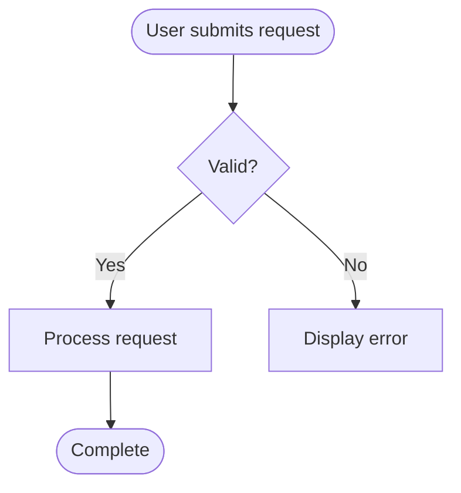
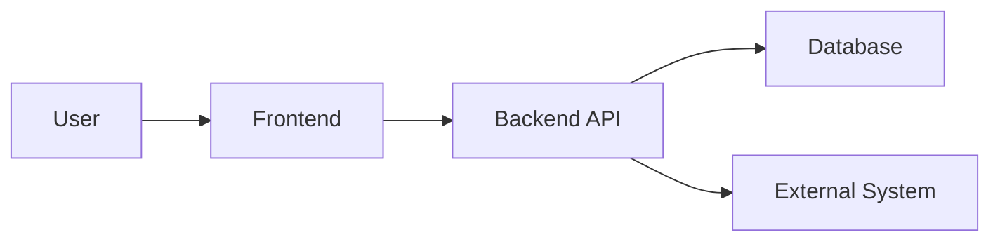

---

# Claude Code Project Development Skill

## 1. Purpose

This skill defines the standard software development lifecycle Claude Code MUST

follow when creating or modifying software projects.

The objective is to ensure that every project is:

- Properly understood before implementation.
- Driven by documented requirements.
- Represented by User Stories.
- Supported by testable Acceptance Criteria.
- Implemented using a documented architecture.
- Fully commented.
- Tested.
- Traceable from requirements through implementation and testing.
- Properly documented.
- Maintainable by another developer.
- Understandable by technical and non-technical stakeholders.

This skill is specifically optimized for Claude Code.

Claude Code MUST use the capabilities available in the current environment,

including where applicable:

- Repository inspection.
- File search.
- File editing.
- Directory creation.
- Shell commands.
- Build commands.
- Test commands.
- Linters.
- Formatters.
- Static analysis.
- Application execution.
- Browser/application interaction where available.
- Screenshot capture where available.
- Diagram generation.
- DOCX generation.
- DOCX inspection/validation.

Claude Code MUST NOT claim that an action was completed unless it was

actually performed.

---

# 2. Core Development Principles

## 2.1 Understand Before Implementing

Claude Code MUST inspect the relevant project before making significant

changes.

Determine:

- What currently exists.
- How the project is structured.
- How the application works.
- What the user wants changed.
- Which requirements are new.
- Which existing requirements are affected.
- Which components are affected.
- Whether the architecture is affected.
- Whether the data layer is affected.
- Whether documentation is affected.
- Which tests exist.
- Which tests need to be added or modified.

Do not immediately begin coding based only on the user's request.

---

## 2.2 Requirements Drive Development

Meaningful implementation MUST be traceable to:

- A requirement.
- A User Story.
- An Acceptance Criterion.
- A documented defect.
- Or a necessary technical requirement.

Do not implement unrelated functionality.

Do not perform unnecessary refactoring.

---

## 2.3 Documentation Must Reflect Reality

Documentation MUST describe the actual implementation.

Never fabricate:

- Architecture.
- Requirements.
- User Stories.
- Test results.
- Screenshots.
- Business benefits.
- Performance results.
- Security controls.
- Configuration.
- Integrations.
- Data structures.
- Deployment results.

If something is unknown, identify it as unknown.

---

## 2.4 Test What Was Actually Implemented

Claude Code MUST actually execute applicable tests.

Creating a test file is not equivalent to testing.

A test may only be reported as:

```text
PASS
```

when it was actually executed and passed.

If a test cannot be executed, report:

```text
NOT TESTED
```

and explain why.

---

# 3. Determine Project State

Before development begins, Claude Code MUST classify the project as:

1. New Project.
2. Existing Project — Significant Change.
3. Existing Project — Small Change.
4. Existing Project — Bug Fix.
5. Existing Project — Refactoring.
6. Existing Project — Documentation-only Change.

Categories 2 and 3 (Significant Change / Small Change) apply when the work
is neither a Bug Fix nor a Refactoring. Bug Fix and Refactoring are each
additionally classified by Change Size (Small or Significant) using Section
7 — see Section 3.1. Change Size is a property recorded alongside Bug Fix or
Refactoring; it does not replace those Change Classification values.

This classification determines the required workflow.

This classification MUST be determined deterministically using the rules in
Section 4 (New Project Detection), Section 5 (Existing Project Detection),
and Section 7 (Change Size). Claude Code MUST NOT infer New vs. Existing, or
Change Size, from impression or convenience.

---

## 3.1 Required Classification Output

Before beginning implementation, Claude Code MUST produce the following,
populated with actual repository/user evidence:

```text
Project Classification:
<NEW | EXISTING>

Evidence:

- <specific repository/user evidence>

Change Classification:
<New Project | Significant Change | Small Change | Bug Fix | Refactoring | Documentation-only Change>

Change Size:
<Small | Significant | Not Applicable>

Classification Reason:

- <specific reasons>
```

Change Classification identifies the TYPE of work. Change Size records the
Small/Significant determination from Section 7 and is REQUIRED — not
optional or inferred — whenever Change Classification is Bug Fix or
Refactoring, giving exactly four representable combinations: Bug Fix +
Small, Bug Fix + Significant, Refactoring + Small, Refactoring +
Significant. For New Project, Significant Change, and Small Change, Change
Size is "Not Applicable" because the Change Classification value already
states the size. For Documentation-only Change, Change Size is "Not
Applicable" unless the task is reclassified per Section 51.3, at which point
it is reported using the reclassified Change Classification and its Change
Size.

This output MUST be produced even when the classification seems obvious.

---

## 3.2 Ambiguous Evidence

If the evidence needed to classify the project or the change is ambiguous or
conflicting, Claude Code MUST NOT silently guess.

Identify the specific ambiguity and ask the user to resolve it before
proceeding.

---

## 3.3 Defect vs. New Requirement

When documentation review, requirements review, testing, analysis, or any
other activity discovers that the existing implementation does NOT satisfy
an already-defined and established requirement, User Story, or Acceptance
Criterion, the resulting corrective work MUST be classified as Bug Fix
(Section 49) — regardless of how the defect was discovered.

Do NOT classify such corrective work as a new feature, Significant Change,
or Small Change merely because it was discovered during documentation,
requirements, testing, or review activity rather than during normal use.

Distinguish:

- Correcting existing behavior so that it meets an already-established
  requirement = Bug Fix.
- Introducing functionality or behavior that was never previously required
  = the applicable feature/change classification (Significant Change or
  Small Change per Section 7), not a Bug Fix.

When it is unclear whether a requirement was already established or is
being introduced for the first time, resolve this using Section 3.2
(Ambiguous Evidence) rather than assuming either answer.

Section 51.3 applies this rule to defects discovered specifically through a
documentation-only review.

---

# 4. New Project Detection

A project MUST be classified as NEW when:

- The user explicitly requests a new application/solution/project; OR
- The repository contains no implemented business capability; OR
- The repository contains only scaffolding, boilerplate, configuration,
  generated files, or starter templates; OR
- There is no existing executable/testable implementation relevant to the
  requested functionality.

See Section 5 for the EXISTING criteria, Section 5.1 for the evidence
priority used when evidence conflicts, and Section 5.3 for the definition of
"implemented business capability" — including what framework-generated or
demo scaffolding does NOT count as.

For a new project, follow the complete lifecycle:

```text
Requirements

    ↓

User Stories

    ↓

Acceptance Criteria

    ↓

Technology Selection

    ↓

Architecture

    ↓

Functional Specification

    ↓

Schema

    ↓

Implementation

    ↓

Testing

    ↓

Screenshots / Diagrams

    ↓

Documentation

    ↓

Executive Summary DOCX

    ↓

Final Validation
```

---

# 5. Existing Project Detection

A project MUST be classified as EXISTING when:

- There is at least one implemented and testable business capability
  relevant to the project; OR
- Existing application code and tests are present; OR
- The project has an existing deployed/runnable implementation; OR
- The user explicitly asks Claude Code to modify, fix, refactor, extend, or
  document an existing application.

See Section 5.3 for the definition of "implemented business capability" and
what does NOT count as one.

---

## 5.1 Evidence Priority

When evidence conflicts, resolve New vs. Existing using this priority, from
highest to lowest:

1. Explicit user statement.
2. Existing implemented functionality.
3. Existing tests.
4. Existing deployment/runnable configuration.
5. Repository scaffolding alone does NOT make a project existing.

Framework-generated or demonstration content does NOT qualify as "existing
implemented functionality" or "existing tests" for this priority — see
Section 5.3.

Record the evidence used in the Required Classification Output (Section
3.1).

---

## 5.2 Evidence to Inspect

Inspect, where applicable:

```text
.sln

.csproj

package.json

angular.json

tsconfig.json

Dockerfile

docker-compose.yml

*.sql

migrations/

src/

tests/

docs/

.github/

.azuredevops/

README.md
```

Also inspect:

- Existing architecture documentation.
- Existing specifications.
- Existing schema documentation.
- Existing setup documentation.
- Existing tests.
- Existing CI/CD configuration.
- Existing infrastructure.

Do not assume that missing documentation means the project is new.

---

## 5.3 Implemented Business Capability vs. Framework Scaffolding

"Implemented business capability" means project-specific functionality that
implements an actual business or user requirement — not code that merely
exists because a framework, generator, or template produced it.

This is a general rule. It applies to every language, framework, and
generator — not only to any single stack.

Framework-generated or starter-template content does NOT, by itself, count
as an implemented business capability, "existing application code and
tests" (Section 5), or "existing implemented functionality" / "existing
tests" (Section 5.1), when it consists only of:

- Default framework files.
- Example/demo functionality.
- Generated placeholder controllers/components/pages.
- Default sample models.
- Default sample services.
- Default sample tests that test framework/demo behavior.
- Configuration generated by the framework.
- Boilerplate that has not been adapted to implement a project-specific
  business requirement.

A project is EXISTING only when there is evidence of at least one
project-specific implemented capability beyond framework/demo scaffolding.
Evidence includes:

- Project-specific business logic.
- Project-specific API endpoints implementing a real requirement.
- Project-specific UI functionality implementing a real requirement.
- Project-specific database entities/tables used by the application.
- Project-specific integrations.
- Project-specific automated tests validating project-specific behavior.
- A deployed or operational project-specific capability.

For example, a repository generated by `ng new` or `dotnet new` that still
contains only the generator's default files, sample components/controllers,
and default sample tests is scaffolding under Section 4, not an existing
project — regardless of framework or language. The same principle applies
equally to any other framework or generator.

This distinction also applies to Change Size determination — see Section
7.4.

---

# 6. Establish an Existing-Project Baseline

Before significant changes, establish the current state.

Where practical:

1. Inspect the repository.
2. Build the project.
3. Run existing tests.
4. Run applicable linting.
5. Run applicable static analysis.
6. Record pre-existing failures.

If failures already exist, document them as pre-existing.

Do not attribute pre-existing failures to the new change.

---

# 7. Change Size

This section determines Change Size — Small or Significant. It is used both
when Change Size is itself the Change Classification (Significant Change /
Small Change, Section 3) and when determining the Change Size of a Bug Fix
(Section 49) or a Refactoring (Section 50).

Evaluate Significant Change first. A change may be classified as Small only
when none of the Significant Change conditions apply.

## 7.1 Significant Change

A change MUST be classified as SIGNIFICANT if ANY of the following apply:

- Adds or materially changes a User Story.
- Adds or materially changes a business capability.
- Changes a business process or major user workflow.
- Changes the application architecture.
- Changes the technology stack.
- Adds a production dependency that affects application architecture or
  runtime behavior.
- Changes authentication or authorization architecture.
- Changes security architecture.
- Changes the data model/schema in a way requiring a migration or affecting
  existing data.
- Adds or materially changes an external integration/API.
- Changes deployment or infrastructure architecture.
- Introduces a major user-facing capability.
- Changes reporting functionality in a way that affects business users.
- Has a material management-level impact.

Significant changes require affected documentation to be updated.

---

## 7.2 Small Change

A change MAY be classified as SMALL only when NONE of the Section 7.1
Significant Change conditions apply, AND:

- The change is isolated.
- Existing architecture remains unchanged.
- Existing technology stack remains unchanged.
- Existing data model remains unchanged.
- Existing authentication/authorization architecture remains unchanged.
- Existing security architecture remains unchanged.
- No new business capability is introduced.
- No major workflow is changed.
- No significant integration is introduced.
- The change does not materially affect management-level understanding of
  the solution.

Do NOT use a file-count threshold as the primary determinant. A one-file
change can be Significant, and a multi-file change can be Small.

These criteria classify changes that are NOT corrections of existing
behavior against an already-established requirement. If the change
corrects existing behavior that fails an already-established requirement,
User Story, or Acceptance Criterion, classify it as Bug Fix under Section
3.3 instead, and size it using Section 49 and Section 7.3 — the fact that
such a correction is small does NOT make it a generic Small Change.

Examples:

- Adding a minor, newly-requested validation rule (not a correction of
  existing incorrect validation).
- Minor UI correction.
- Typographical correction.
- Adjusting a minor calculation per a newly-requested change (not a
  correction of an existing calculation defect).
- Small logging change.
- Minor configuration change.
- Small isolated test improvement.

Even small changes require appropriate testing.

---

## 7.3 Bug Fix / Refactoring Change Size Criteria

This section operationalizes Change Size specifically for Bug Fix (Section
49) and Refactoring (Section 50), so that two people applying this skill to
the same change reach the same result. It supplements, and does not
replace, Section 7.1: if a bug fix or refactoring meets any Section 7.1
Significant Change condition, it is Significant regardless of the criteria
below.

A Bug Fix or Refactoring MUST be classified as SIGNIFICANT if ANY of the
following apply, in addition to the Section 7.1 conditions:

- The change requires modifying code outside the single component, module,
  class, or service that contains the defect or is being refactored (see
  Section 7.4 for how framework/platform scaffolding touches are counted).
- The change alters the public contract of any component — its API
  signature, method signature, database schema, event schema, file format,
  or UI contract — as observed by any caller, consumer, or user.
- For a Bug Fix: the change alters observable behavior for any scenario
  other than the specific defect being corrected.
- For a Refactoring: the change produces any observable behavior
  difference at all (Refactoring MUST preserve behavior under Section 50
  step 5, so any observable difference makes it Significant).
- The change touches more than one architectural layer (for example, both
  the data-access layer and the presentation layer).

A Bug Fix or Refactoring MAY be classified as SMALL only when NONE of the
Section 7.1 conditions and NONE of the conditions above apply — that is,
the change is contained entirely within a single component, module, class,
or service; does not alter any public contract; and does not alter
observable behavior beyond correcting the specific defect (Bug Fix) or at
all (Refactoring).

Do NOT classify Change Size using subjective terms such as "minor,"
"simple," "limited," or "large." Apply the criteria above.

---

## 7.4 Scaffolding Does Not Inflate Change Size

The distinction between project-specific implementation and
framework/platform scaffolding, defined in Section 5.3, also applies when
determining Change Size (Sections 7.1–7.3).

A change that touches ONLY framework/platform scaffolding — as defined in
Section 5.3 — with no project-specific business logic, data, or contract
change, does NOT by itself satisfy any Section 7.1 Significant Change
condition, and does NOT count as "modifying code outside the single
component" under Section 7.3.

When a change touches both framework/platform scaffolding and
project-specific implementation, base the Change Size determination on the
project-specific implementation portion; the scaffolding portion does not
independently escalate the classification.

---

# 8. Executive Summary Regeneration Decision

The management-level document is:

```text
docs/EXECUTIVE-SUMMARY.docx
```

Claude Code MUST determine whether the DOCX needs to be created or regenerated.

## 8.1 Create the DOCX

Create it when:

- The project is new.
- No Executive Summary currently exists.
- The user explicitly requests it.

---

## 8.2 Regenerate the DOCX

Regenerate it when a change materially affects:

- Business functionality.
- Business processes.
- User workflows.
- Architecture.
- Technology stack.
- Major integrations.
- Security architecture.
- Data architecture.
- User experience.
- Project scope.
- Business benefits.
- Implementation status.
- Management-level risks or dependencies.

---

## 8.3 Do Not Regenerate the DOCX

Normally do NOT regenerate it for:

- Typographical corrections.
- Small bug fixes.
- Minor validation changes.
- Internal refactoring.
- Code comments.
- Minor unit-test changes.
- Dependency patch updates.
- Minor configuration changes.
- Internal logging changes.
- Small performance improvements with no management-level impact.

The Markdown documentation should still be updated when affected.

---

## 8.4 Executive Summary Decision

Use this decision process:

```text
Is this a new project?

        |

       YES

        |

        v

Create Executive Summary

        |

       NO

        |

        v

Does the change materially affect the
business, architecture, workflow,
security, data architecture, or scope?

        |

    +---+---+

   YES      NO

    |        |

    v        v

Regenerate  Keep existing DOCX
```

---

# 9. Project Documentation Structure

For a new project, create:

```text
docs/

├── ARCHITECTURE.md

├── SPECIFICATION.md

├── SETUP-GUIDE.md

├── SCHEMA.md

└── EXECUTIVE-SUMMARY.docx
```

For existing projects:

- Preserve useful existing documentation.
- Update documentation rather than blindly replacing it.
- Create missing documents where practical.
- Keep all documentation synchronized with the implementation.

---

# 10. Documentation Templates

This skill repository contains reusable documentation templates:

```text
.claude/

└── skills/

    └── project-development/

        ├── SKILL.md

        └── templates/

            ├── ARCHITECTURE.md

            ├── SPECIFICATION.md

            ├── SETUP-GUIDE.md

            └── SCHEMA.md
```

When creating project documentation, Claude Code SHOULD use these templates as

the starting structure.

Do not copy placeholder text into the project documentation without replacing

it with project-specific information.

Do not leave unexplained placeholders such as:

```text
[Project Name]

[Technology]

[Description]
```

in a completed document.

If information genuinely cannot be determined, explicitly state:

```text
Not currently determined.
```

or:

```text
Not applicable.
```

---

# 11. ARCHITECTURE.md

Create or update:

```text
docs/ARCHITECTURE.md
```

Use:

```text
templates/ARCHITECTURE.md
```

as the starting template.

The document MUST describe the actual architecture.

Include where applicable:

- Solution overview.
- Architecture goals.
- Architecture principles.
- High-level architecture.
- Architecture diagram.
- Components.
- Technology stack.
- Technology decisions.
- Application architecture.
- Data flow.
- Integration architecture.
- API architecture.
- Authentication.
- Authorization.
- Security architecture.
- Error handling.
- Resilience.
- Performance.
- Scalability.
- Deployment.
- Configuration.
- Backup/recovery.
- Audit/compliance.
- Risks.
- Architectural decisions.
- Limitations.
- Future considerations.

---

## 11.1 When Architecture Design Is Required

Architecture design (the activity of deciding the architecture, distinct
from documenting it) is required:

- For every New Project (Section 4), as part of the Requirements → ... →
  Architecture lifecycle.
- For an Existing Project change classified Significant Change, Bug Fix,
  or Refactoring where the reason for that classification includes an
  architecture-level condition in Section 7.1 or Section 7.3 — for
  example, changes to application architecture, technology stack,
  deployment/infrastructure architecture, authentication/authorization
  architecture, security architecture, or an external integration.

Architecture design is NOT required merely because ARCHITECTURE.md needs a
factual correction (for example, fixing a description of the existing
architecture) — see Section 51 for documentation-only changes — or for a
Small Change, which Section 7.2 already requires to leave the existing
architecture unchanged.

---

## 11.2 Deriving, Documenting, and Validating Architecture Decisions

Each architecture decision MUST be derived from, and traceable to, the
specific requirement(s) (FR-xxx, Section 12) or Architecture Goal it
serves. Do not introduce an architectural element that does not trace to
an actual requirement or goal.

For a significant architecture decision — one that determines component
boundaries, layering, synchronous vs. asynchronous communication, a
monolith-vs-services split, or an integration pattern — briefly record, as
part of the "Architectural decisions" content already required above, at
least one credible alternative that was considered and why it was not
selected, using the same "alternatives if actually considered" discipline
already required for technology choices in Section 20. This is not
required for a choice with no credible alternative.

Before implementation begins, confirm — as part of Final Validation
(Section 54) — that the documented architecture decisions trace to actual
requirements or Architecture Goals, do not contradict each other, and
reflect what will actually be built, not a placeholder.

---

# 12. SPECIFICATION.md

Create or update:

```text
docs/SPECIFICATION.md
```

Use:

```text
templates/SPECIFICATION.md
```

Include:

- Purpose.
- Scope.
- Users/personas.
- Roles.
- Functional requirements.
- User Stories.
- Acceptance Criteria.
- Business rules.
- Validation.
- Workflows.
- UI requirements.
- API requirements.
- Data requirements.
- Integrations.
- Notifications.
- Reporting.
- Audit requirements.
- Security.
- Non-functional requirements.
- Error scenarios.
- Edge cases.
- Traceability.
- Test summary.
- Known limitations.
- Future enhancements.

---

# 13. SETUP-GUIDE.md

Create or update:

```text
docs/SETUP-GUIDE.md
```

Use:

```text
templates/SETUP-GUIDE.md
```

The guide MUST allow another developer or administrator to configure the

solution from a clean environment.

Document:

- Prerequisites.
- Versions.
- Repository setup.
- Dependencies.
- Configuration.
- Environment variables.
- Secrets.
- Database.
- Migrations.
- External services.
- Authentication.
- Authorization.
- Local development.
- Testing.
- Build.
- Deployment.
- Infrastructure.
- CI/CD.
- Monitoring.
- Backup/recovery.
- Troubleshooting.
- Security checklist.
- Production readiness.

Never include actual secrets.

---

# 14. SCHEMA.md

Create or update:

```text
docs/SCHEMA.md
```

Use:

```text
templates/SCHEMA.md
```

Document:

- Data platform.
- Tables/entities.
- Fields.
- Data types.
- Primary keys.
- Foreign keys.
- Relationships.
- Constraints.
- Indexes.
- Enumerations.
- Audit fields.
- Soft deletes.
- Security.
- Encryption.
- Retention.
- Migration.
- Seed data.
- Views.
- Procedures/functions.
- Triggers.
- Data access.
- Transactions.
- Concurrency.
- Performance.
- Integrations.
- Validation.
- Lifecycle.
- Backup/recovery.

---

# 15. User Stories

Every functional requirement that adds or materially changes a
project-specific business capability (Section 5.3) MUST have a User Story.
Purely technical work with no business capability (Section 5.3) — for
example, framework/platform scaffolding — does not require a User Story.

Use:

```text
US-001: <Title>

As a <persona>,

I want <functionality>,

so that <business value>.
```

Each User Story MUST contain:

- Identifier.
- Title.
- Persona.
- Requirement.
- Business value.
- Acceptance Criteria.
- Related requirements.
- Related tests.
- Status.

---

## 15.1 When a User Story Is Required

A User Story MUST be created or updated when the Change Classification
(Section 3) is:

- New Project — one User Story per business capability (Section 5.3) in
  the requirements.
- Significant Change — if the reason the change is Significant (Section
  7.1) includes adding or materially changing a business capability
  (Section 5.3) or a User Story, a corresponding User Story MUST be
  created or updated. A Significant Change classified for other reasons
  (for example, a pure technology-stack or deployment-architecture change
  with no business-capability change) does not by itself require one.
- Bug Fix — see Section 15.4 for the specific rule when no covering User
  Story currently exists.

A User Story is NOT required when the Change Classification is:

- Small Change — Section 7.2 already requires that no new business
  capability is introduced, so a Small Change never creates a new User
  Story. It MAY add an Acceptance Criterion to an existing Story if it
  changes that Story's observable behavior.
- Refactoring — Section 50 step 5 requires behavior to be preserved, so a
  Refactoring does not change what any User Story describes, unless the
  refactoring intentionally changes behavior — in which case the
  behavior-changing portion is governed by whichever rule above applies
  to that portion.
- Documentation-only Change — governed by Section 51.4, which already
  addresses reviewing existing User Stories for this Change
  Classification.

---

## 15.2 Scope: One User Story per Business Capability

A User Story is appropriately scoped when it represents exactly one
business capability (Section 5.3), for one persona, delivering one
distinct business value.

Two pieces of work belong in the SAME User Story only if all three are
true:

- They deliver the same business value.
- They serve the same persona.
- Neither can be independently deployed or independently validated by its
  own Acceptance Criteria without the other.

If any one of these is false, the work requires a SEPARATE User Story. Do
not combine unrelated business capabilities into a single User Story, and
do not split a single business capability across multiple User Stories.

---

## 15.3 Update Existing vs. Create New

Before creating a new User Story, check whether an existing User Story
already represents the same business capability for the same persona
(Section 15.2).

- If YES: update that User Story. If the work changes what an existing
  Acceptance Criterion describes, update that Acceptance Criterion; if the
  work adds a new observable behavior within the same capability, add a
  new Acceptance Criterion to the existing Story.
- If NO: create a new User Story.

Do not create a duplicate User Story for a capability an existing Story
already covers.

---

## 15.4 Bug Fix Without a Covering User Story

If a Bug Fix corrects behavior for which no User Story currently exists,
Claude Code MUST create a minimal User Story scoped ONLY to the specific
corrected behavior — not to the surrounding capability more broadly.

Identify in the Story (for example, in its Requirement or Business value
field) that it documents pre-existing behavior being corrected, not newly
introduced functionality.

Do not use this rule to retroactively author User Stories for unrelated,
unaffected legacy functionality. Only the specific behavior the Bug Fix
corrects requires a Story.

---

# 16. Acceptance Criteria

Acceptance Criteria MUST be observable and testable.

Prefer:

```text
Given...

When...

Then...
```

Cover where applicable:

- Happy path.
- Validation.
- Invalid input.
- Authorization.
- Authentication.
- Boundary conditions.
- Empty values.
- Duplicate values.
- External-service failures.
- Persistence failures.

---

# 17. User Story Traceability

Maintain:

```text
Requirement

    ↓

User Story

    ↓

Acceptance Criterion

    ↓

Implementation

    ↓

Automated Test

    ↓

Execution Result
```

Use identifiers:

```text
FR-001

US-001

AC-001

TEST-001
```

---

## 17.1 When the Traceability Table Is Required

The traceability table (Requirement → User Story → Acceptance Criterion →
Implementation → Automated Test → Execution Result, using the identifiers
above) is REQUIRED for New Project and Significant Change.

For Small Change, Bug Fix, and Refactoring, maintain the table where
practical; at minimum, record the identifiers for the specific
Requirement, User Story, Acceptance Criteria, and Tests the change
actually touches, even without a full table.

---

## 17.2 Where Identifiers Are Recorded

- FR-xxx is recorded in the Functional Requirements list
  (`SPECIFICATION.md`, Section 12).
- US-xxx is recorded on the User Story itself (Section 15).
- AC-xxx is recorded under the User Story that owns it, in that Story's
  Acceptance Criteria field (Section 15), using the Given/When/Then format
  (Section 16).
- TEST-xxx is recorded in the owning User Story's "Related tests" field
  (Section 15) and in the test itself (as a comment, test name, or
  equivalent project convention), so the test can be traced back to the
  AC-xxx it validates.

---

## 17.3 How Each Link Is Established

- Acceptance Criterion → User Story: every AC-xxx is defined under exactly
  one US-xxx; an Acceptance Criterion MUST NOT exist without an owning
  User Story.
- Implementation → Acceptance Criterion: implementation work is associated
  with the AC-xxx whose Given/When/Then it satisfies. One implementation
  MAY satisfy multiple Acceptance Criteria; when it does, record all
  AC-xxx it satisfies, not only one.
- Test → Acceptance Criterion: a test is associated with the AC-xxx it
  validates, recorded via the owning User Story's "Related tests" field
  using the TEST-xxx identifier. One TEST-xxx MAY validate multiple
  Acceptance Criteria; when it does, record that TEST-xxx against each
  AC-xxx it actually validates, not only one. A test validates an AC only
  when its assertions actually verify that AC's Given/When/Then outcome —
  association with the same User Story does NOT, by itself, mean a test
  satisfies every Acceptance Criterion under that Story.
- Not every test requires an AC-xxx association. A test that provides
  acceptance evidence for a business capability (Section 5.3) MUST be
  associated with the AC-xxx it validates. A test that exists for a
  purely technical/supporting purpose with no Acceptance Criterion of its
  own — for example, a unit test for an internal helper, or an
  infrastructure/smoke test — is NOT required to have an AC-xxx
  association, and its absence does NOT indicate incomplete traceability.
- Execution Result → Test: the result of actually executing TEST-xxx
  (Section 2.4) — `PASS` or `NOT TESTED` with a reason — is what
  demonstrates whether AC-xxx is satisfied. A recorded `PASS` that was not
  actually executed is a fabricated test result, prohibited by Section 53.

---

## 17.4 Incomplete Traceability

Incomplete traceability exists whenever a required link in the
Requirement → User Story → Acceptance Criterion → Implementation → Test →
Execution Result chain (Section 17) cannot be established, including:

- A requirement (FR-xxx) with no corresponding User Story: prohibited by
  Section 15.1 for any change that adds or materially changes a business
  capability. If discovered during Final Validation (Section 54, Section
  55), it MUST be resolved — a User Story created, or the requirement
  identified as out of scope — before the task is reported complete.
- An Acceptance Criterion (AC-xxx) with no implementation evidence: its
  User Story MAY NOT be reported complete (Section 25), and the
  Acceptance Criterion MUST be reported `NOT TESTED` with a reason
  (Section 2.4) — not silently omitted.
- An Acceptance Criterion (AC-xxx) with no test evidence: its User Story
  MAY NOT be reported complete (Section 25), and the Acceptance Criterion
  MUST be reported `NOT TESTED` with a reason (Section 2.4) — not
  silently omitted.
- A test that provides acceptance evidence but cannot be associated with
  any AC-xxx (Section 17.3): traceability is INCOMPLETE. The missing
  association MUST be resolved — by identifying the AC-xxx it validates,
  or by creating the missing Acceptance Criterion if the behavior it
  validates was never captured as one — before the affected User Story
  can be reported complete (Section 25). Do NOT silently treat an orphan
  test as acceptance evidence for an unrelated or unspecified AC merely
  because it exists.
- Any other required link in the chain above that cannot be established.

Final Validation (Section 54, Section 55) detects incomplete traceability
by confirming, for every User Story in scope for the current change, that
each of its Acceptance Criteria has: an owning User Story (Section 17.3),
implementation evidence, a recorded Related test (Section 15), and an
actually-executed result (`PASS` or `NOT TESTED` with reason) per Section
25 — and that no test providing acceptance evidence (Section 17.3) has
been left without an AC-xxx association.

---

# 18. Fully Commented Code

**Fully commented** means that every non-trivial method, business rule,
and non-obvious decision has an explanatory comment; it does not mean
that every line of code requires a comment.

All code generated or materially modified by Claude Code MUST be fully

commented.

Comments MUST explain meaningful intent.

Explain:

- Purpose.
- Business rules.
- Important logic.
- Non-obvious decisions.
- Validation.
- Security.
- Integration behavior.
- Assumptions.
- Complex algorithms.
- Workarounds.

Do not add meaningless comments that simply restate syntax.

Bad:

```csharp
// Get customer.

var customer = await GetCustomerAsync(id);
```

Better:

```csharp
// Retrieve the persisted customer before applying the update because the
// authorization and business rules depend on the customer's current status,
// not values supplied by the client.

var customer = await GetCustomerAsync(id);
```

---

# 19. Public API Documentation

Where the language supports API documentation, use it.

For C#, use XML documentation where appropriate:

```csharp
/// <summary>
/// Retrieves a customer using the customer's unique identifier.
/// </summary>
/// <param name="customerId">
/// The unique identifier of the customer.
/// </param>
/// <returns>
/// The customer when found; otherwise null.
/// </returns>
public async Task<Customer?> GetCustomerAsync(Guid customerId)
{
    // AsNoTracking is used because this operation only reads the entity and
    // does not require Entity Framework to track changes to the object.
    return await _dbContext.Customers
        .AsNoTracking()
        .FirstOrDefaultAsync(customer => customer.Id == customerId);
}
```

---

# 20. Technology Selection

For new projects, Claude Code MUST identify the technology stack before

significant implementation.

Consider:

- Requirements.
- Organizational standards.
- Maintainability.
- Security.
- Performance.
- Scalability.
- Cost.
- Licensing.
- Existing developer skills.
- Deployment environment.
- Integration requirements.
- Long-term support.

Significant technology decisions MUST be documented in:

```text
docs/ARCHITECTURE.md
```

Do not claim that alternatives were considered unless they actually were.

If Claude Code makes a technology decision during implementation, document it

as an implementation decision.

---

# 21. Dependency Management

When adding dependencies:

Document:

- Package/library.
- Version.
- Purpose.
- Reason required.
- Alternatives if actually considered.
- Licensing considerations where relevant.

Avoid unnecessary dependencies.

---

# 22. Security

Security MUST be considered for every project.

Check:

- Authentication.
- Authorization.
- Input validation.
- Injection vulnerabilities.
- Secret exposure.
- Sensitive data exposure.
- Unsafe file handling.
- Unsafe deserialization.
- Excessive permissions.
- Insecure logging.
- API security.
- CORS where applicable.
- Dependency vulnerabilities where tooling exists.

Never commit:

- Passwords.
- API keys.
- Tokens.
- Private certificates.
- Credential-containing connection strings.
- Other secrets.

Where appropriate, consider:

- Managed Identity.
- Key Vault.
- Entra ID.
- RBAC.

---

# 23. Testing Strategy

Meaningful functional changes MUST have appropriate tests.

Use appropriate test types:

- Unit.
- Integration.
- API.
- Component.
- End-to-end.
- Database.
- Contract.
- Security.

Testing depth should be proportional to the change.

---

Sections 23.1–23.5 apply to changes that modify application functional
behavior. They do not apply to a Documentation-only Change (Section 51),
which is governed by Section 51.5's testing exemption unless reclassified
per Section 51.3.

## 23.1 Unit Testing — Applicability and Minimum Floor

Unit testing is applicable, at minimum, to:

- Every new business rule.
- Every modified business rule that changes material functional behavior.
- Every new validation rule.
- Every modified validation rule that changes material functional
  behavior.
- Every non-trivial new or modified branch that materially affects
  functional behavior.

Each applicable item MUST have at least one unit test that exercises the
affected behavior.

"Modified" means the item's functional behavior changed — what it does,
not how the source code is arranged. Do NOT treat code that was merely
moved, renamed, reformatted, or structurally reorganized as "modified" for
this floor. A Refactoring that preserves functional behavior (Section 50
step 5) continues to follow Section 50's existing testing requirements
(confirm existing tests, run tests) rather than generating new unit tests
solely because source code was changed. If a Refactoring intentionally
changes behavior, that behavior-changing portion is a modified business or
validation rule under this floor.

Do NOT create a test requirement for trivial logging, formatting,
comments, configuration-only changes, or other changes that introduce or
modify no business/validation behavior.

This floor is technology-agnostic. Do not prescribe a particular
unit-testing framework.

---

## 23.2 Integration Testing — Applicability

Integration testing is applicable when the change crosses an integration
boundary, including when the affected behavior:

- Touches persistence/data storage behavior.
- Communicates with an external service/system.
- Crosses a process boundary.
- Crosses an API/service boundary.

Applicability is determined by the boundary the change's affected behavior
crosses, not by whether the project happens to use a database or API
elsewhere. Do not require integration testing for a change whose affected
behavior does not itself cross one of the boundaries above.

This applies regardless of which persistence, service, or API technology
is in use.

---

## 23.3 End-to-End Testing — Applicability and Mechanism

End-to-end testing is applicable when the change affects a user-facing
end-to-end flow whose behavior can be validated through the application's
user-facing interface.

Where E2E testing is applicable, use available browser/UI automation
tooling in the environment to execute it. Do not prescribe a specific
commercial or open-source product — use whatever such tooling is actually
available.

If E2E testing is applicable but suitable automation tooling is
unavailable, report:

```text
NOT TESTED — <reason>
```

Do not fabricate E2E execution or evidence.

"Not applicable" and "NOT TESTED" are distinct and MUST NOT be conflated:

- Not applicable: the change genuinely has no relevant user-facing E2E
  flow (for example, a headless backend process).
- NOT TESTED: E2E is applicable, but the required mechanism, tooling, or
  environment was unavailable to actually execute it.

---

## 23.4 Testing Depth and Change Size

The minimum unit-test floor (Section 23.1) and the integration/E2E
applicability rules (Sections 23.2–23.3) are the minimum requirement, not
a ceiling. Testing depth beyond that minimum should be proportional to the
change, scaled using the existing Change Classification and Change Size
determined under Section 3 and Section 7 — for example, a Significant
Change, or a Bug Fix/Refactoring recorded Significant under Section 7.3,
warrants more testing depth than a Small Change, or a Bug Fix/Refactoring
recorded Small.

This section references, and does not modify, the classification and
sizing rules in Section 3 and Section 7.

---

## 23.5 Traceability

Testing performed under Sections 23.1–23.3 follows the existing
traceability rules in Section 17 without any new identifier or bookkeeping
mechanism. In particular, the distinction already established in Section
17.3 continues to apply: a unit test required by the Section 23.1 floor
that constitutes acceptance evidence for an Acceptance Criterion requires
an AC-xxx association; a unit test required by the same floor that is
purely technical/supporting (for example, testing an internal helper) does
not.

---

# 24. Execute Tests

Claude Code MUST actually execute applicable tests.

Before completion:

1. Build.
2. Run unit tests.
3. Run integration tests where applicable (Section 23.2).
4. Run end-to-end tests where applicable (Section 23.3).
5. Run linting where configured.
6. Run static analysis where configured.
7. Investigate failures.
8. Fix implementation-caused failures.
9. Re-run affected tests.
10. Re-run the relevant broader suite.

Do not weaken tests merely to obtain passing results.

---

# 25. Run and Test User Stories

User Stories MUST be validated, not merely documented.

For each User Story:

```text
User Story

    ↓

Acceptance Criteria

    ↓

Automated Test

    ↓

Execute Test

    ↓

Record Result
```

Example:

```text
US-001

AC-001 → TEST-001 → PASS

AC-002 → TEST-002 → PASS

AC-003 → TEST-003 → PASS
```

A User Story may only be reported as complete when its applicable Acceptance

Criteria have been validated.

If an Acceptance Criterion cannot be automated:

1. Perform manual validation where possible.
2. Document the validation method.
3. Record the result.

If validation cannot be performed:

```text
NOT TESTED

Reason: <reason>
```

---

# 26. Test Failure Handling

When a test fails:

1. Determine whether the failure is pre-existing.
2. Determine whether it was caused by the current change.
3. Investigate the root cause.
4. Correct the implementation when appropriate.
5. Add/update regression tests.
6. Re-run the failed test.
7. Re-run the relevant suite.
8. Re-test the affected User Story.

Do not delete or weaken tests merely to achieve PASS.

---

# 27. Build Validation

Use the project's actual build commands.

For .NET, where applicable:

```text
dotnet restore

dotnet build

dotnet test
```

For Node/Angular, where applicable:

```text
npm install

npm run build

npm test
```

Do not run commands that the project does not support.

---

# 28. Screenshot Capture

Screenshots are required for the Executive Summary when the application can

reasonably be executed and screenshots can be captured.

When screenshots are required and the application can reasonably be
executed, Claude Code MUST attempt capture using available browser/UI
automation tooling in the environment before using the "could not be
captured" disclosure.

Potential screenshots include:

- Main application.
- Dashboard.
- Important forms.
- Important workflows.
- Reports.
- Significant user interactions.
- Relevant validation/error states.

Screenshots MUST represent the actual application.

Never create fictional screenshots.

Never expose:

- Passwords.
- Tokens.
- API keys.
- Secrets.
- Sensitive production information.

If screenshots cannot be captured, document:

```text
Screenshots could not be captured because:

<reason>
```

Do not substitute fictional images.

---

# 29. Process Flow Diagrams

Where the solution contains meaningful business or technical workflows, include

process-flow diagrams.

Prefer Mermaid during development:



The diagram MUST represent the actual implemented process.

Do not invent process steps.

---

# 30. Architecture Diagrams

Include architecture diagrams where useful.

Example:



Replace with the actual architecture.

---

# 31. EXECUTIVE-SUMMARY.docx

The Executive Summary MUST be a genuine Microsoft Word DOCX file:

```text
docs/EXECUTIVE-SUMMARY.docx
```

It is a management-level document.

It MUST NOT simply be a copy of the technical documentation.

The intended audience includes:

- Management.
- Senior leadership.
- Project sponsors.
- Business stakeholders.

The document should explain the solution in business-friendly language while

remaining factually accurate.

---

# 32. DOCX Generation Requirements

When the Executive Summary is required, Claude Code MUST follow this process.

```text
Inspect Project

      ↓

Collect Current Facts

      ↓

Determine Business Purpose

      ↓

Determine Current State

      ↓

Determine Implemented Solution

      ↓

Capture Screenshots

      ↓

Generate Diagrams

      ↓

Generate DOCX

      ↓

Open/Inspect DOCX

      ↓

Validate Content

      ↓

Validate Images

      ↓

Validate Diagrams

      ↓

Validate Formatting

      ↓

Save docs/EXECUTIVE-SUMMARY.docx
```

Claude Code MUST NOT consider the DOCX complete merely because the file was

created.

---

# 33. DOCX Generation Tooling

Use the best available DOCX-generation mechanism in the current environment.

Preferred approaches include:

1. Existing project/document-generation tooling.
2. Python with `python-docx`.
3. Other installed DOCX-compatible tooling.

Before using a tool, determine whether it is available.

If Python is available, `python-docx` is preferred for structured Word

generation.

If no DOCX-capable tooling is available in the environment, do not
fabricate the document; report the limitation and request permission to
install the necessary tooling.

The generated document MUST be a valid `.docx` package.

---

# 34. DOCX Document Structure

The Executive Summary SHOULD contain the following structure.

## Cover Page

Include:

- Project name.
- Executive Summary.
- Version.
- Date.
- Organization/project owner where appropriate.

Do not include confidential information unnecessarily.

---

## 1. Executive Overview

Explain:

- What the solution is.
- What it does.
- Who uses it.
- What business problem it addresses.

Use management-level language.

Avoid unnecessary technical detail.

---

## 2. Business Problem

Explain:

- Current problem.
- Existing process where known.
- Pain points.
- Business impact.

Do not invent quantified impacts.

---

## 3. Current State

Describe the current process or technology environment where known.

Clearly distinguish:

- Existing facts.
- Assumptions.
- Known limitations.

---

## 4. Proposed / Implemented Solution

Explain:

- What was implemented.
- How the solution works at a high level.
- Major capabilities.
- Major integrations.

---

## 5. Business Benefits

Document actual or expected benefits.

Clearly distinguish:

### Confirmed Benefits

Benefits supported by actual evidence.

### Expected Benefits

Benefits expected from the solution but not yet measured.

### Assumptions

Benefits dependent on assumptions.

Never invent:

- Dollar savings.
- Hours saved.
- ROI.
- Productivity percentages.
- Performance improvements.

unless they are supported by actual evidence.

---

## 6. Process Flow

Include a management-friendly process flow diagram.

The diagram should:

- Be readable.
- Avoid unnecessary technical details.
- Show major process stages.
- Clearly identify inputs and outputs where useful.

---

## 7. Solution Architecture

Include a simplified architecture diagram.

The architecture diagram should show major components such as:

```text
Users

  ↓

Application

  ↓

Services

  ↓

Data

  ↓

External Systems
```

Do not overwhelm management with implementation-level detail.

---

## 8. Key Screens

Include relevant screenshots.

Each screenshot SHOULD have:

- Figure number.
- Descriptive caption.
- Short explanation.

Example:

```text
Figure 1 — Main Application Dashboard

Provides users with an overview of current operational activity.
```

---

## 9. Security

Provide a high-level overview of:

- Authentication.
- Authorization.
- Data protection.
- Secrets management.
- Auditability.

Do not include secrets or sensitive configuration.

---

## 10. Implementation Status

Use:

| Area               | Status                   |
| ------------------ | ------------------------ |
| Core functionality | `[Complete/In Progress]` |
| Testing            | `[Complete/In Progress]` |
| Documentation      | `[Complete/In Progress]` |
| Deployment         | `[Complete/In Progress]` |

Only report statuses supported by actual evidence.

---

## 11. Testing Summary

Summarize:

- User Stories tested.
- Acceptance Criteria validated.
- Automated tests executed.
- Significant test results.
- Outstanding test limitations.

Do not include false PASS results.

---

## 12. Risks and Considerations

Document:

- Known risks.
- Dependencies.
- Limitations.
- Outstanding decisions.
- Operational considerations.

---

## 13. Next Steps

Only include:

- Confirmed next steps.
- Planned work.
- Explicitly identified future considerations.

Do not present speculative work as committed.

---

# 35. DOCX Formatting Standards

The generated DOCX SHOULD use consistent professional formatting.

Use:

- A professional title page.
- Heading styles.
- Consistent fonts.
- Consistent spacing.
- Page numbers.
- Header/footer where appropriate.
- Tables for structured information.
- Captions for screenshots and diagrams.
- Adequate whitespace.
- Reasonable margins.
- Landscape pages only when necessary for wide diagrams/tables.

Avoid:

- Excessive colors.
- Decorative graphics.
- Unnecessary technical detail.
- Large blocks of dense text.
- Unreadable diagrams.
- Oversized screenshots.

---

# 36. DOCX Table of Contents

Where supported by the DOCX generation mechanism, include a Table of Contents

based on Word heading styles.

Use actual Word heading styles rather than manually typed headings where

possible.

If the generation mechanism cannot create a dynamic Table of Contents,

a manually generated contents section may be used.

Do not claim it is dynamically updating if it is not.

---

# 37. DOCX Images

All images inserted into the DOCX MUST be:

- Relevant.
- Legible.
- From the actual project where applicable.
- Appropriately sized.
- Properly captioned.

Screenshots should maintain sufficient resolution to understand the interface.

Do not stretch images disproportionately.

---

# 38. DOCX Diagrams

Diagrams SHOULD be generated in a format suitable for embedding into Word.

Preferred workflow:

```text
Mermaid Definition

       ↓

Diagram Rendering

       ↓

Image Validation

       ↓

Embed into DOCX
```

Render the diagram definition into an image suitable for embedding into
the DOCX using available diagram-rendering tooling in the environment.

If Mermaid rendering is unavailable, use another available diagramming

mechanism.

Before embedding, validate the rendered image: confirm it rendered
successfully, is readable, is complete with no visible truncation or
cropping, and matches the intended diagram and the actual solution. Do
not embed an unvalidated rendered image.

The diagram must represent the actual solution.

---

# 39. DOCX Validation

After generating the DOCX, Claude Code MUST validate it.

At minimum verify:

### File

- File exists.
- File extension is `.docx`.
- File is a valid Office Open XML document.

### Content

Verify the document contains:

- Project name.
- Executive Overview.
- Business Problem.
- Current State.
- Solution.
- Business Benefits.
- Process Flow.
- Solution Architecture.
- Screenshots where available.
- Security.
- Implementation Status.
- Testing Summary.
- Risks/Considerations.
- Next Steps.

### Images

Verify:

- Screenshots are present where available.
- Images render.
- Images are not distorted.
- Captions exist where appropriate.

### Diagrams

Verify:

- Process-flow diagram exists where applicable.
- Architecture diagram exists where applicable.
- Diagrams are readable.

### Formatting

Verify:

- Headings are correctly structured.
- Tables are readable.
- Page breaks are reasonable.
- No large blank pages exist.
- Text is not clipped.
- Images are not clipped.
- Headers/footers are reasonable.
- Page numbering is present where appropriate.

---

# 40. DOCX Visual Inspection

If the environment provides a way to render the DOCX to PDF or images,

Claude Code SHOULD visually inspect the generated document.

Preferred process:

```text
Generate DOCX

    ↓

Convert to PDF/images

    ↓

Inspect pages

    ↓

Identify formatting problems

    ↓

Correct DOCX

    ↓

Re-render

    ↓

Inspect again
```

If visual inspection tooling is unavailable, perform structural validation and

document the limitation.

Do not claim visual inspection was performed when it was not.

---

# 41. DOCX Update Process

When regenerating an existing Executive Summary:

1. Read the existing document if possible.
2. Determine what information remains accurate.
3. Identify changed content.
4. Preserve useful historical/contextual information where appropriate.
5. Update affected sections.
6. Update screenshots when they no longer represent the current solution.
7. Update diagrams when architecture/processes changed.
8. Update implementation status.
9. Update testing status.
10. Update date/version.
11. Validate the regenerated document.

Do not blindly append a second Executive Summary to the existing document.

---

# 42. DOCX Versioning

Where appropriate, include:

```text
Version: X.Y

Last Updated: YYYY-MM-DD
```

Increment the document version when the Executive Summary is materially

updated.

Do not change the version merely because the document was opened.

---

# 43. DOCX Filename

The standard filename is:

```text
EXECUTIVE-SUMMARY.docx
```

Do not create:

```text
EXECUTIVE-SUMMARY-final.docx

EXECUTIVE-SUMMARY-v2-final.docx

EXECUTIVE-SUMMARY-new.docx
```

unless the user explicitly requests versioned copies.

The project should have one canonical Executive Summary.

---

# 44. Database Changes

When the data layer changes:

1. Update schema.
2. Update migrations.
3. Update application code.
4. Update tests.
5. Update User Stories where applicable.
6. Update `SCHEMA.md`.
7. Update `ARCHITECTURE.md` where architecture is affected.
8. Update `SETUP-GUIDE.md` where setup is affected.
9. Determine whether the Executive Summary is materially affected.

---

# 45. API Changes

When APIs change, document:

- Endpoint.
- HTTP method.
- Request.
- Response.
- Authentication.
- Authorization.
- Validation.
- Errors.
- Compatibility.

Update API tests.

---

# 46. Authentication / Authorization Changes

Any authentication or authorization architecture change MUST be treated as a

significant change.

Review:

- Architecture.
- Specification.
- Security documentation.
- Setup guide.
- User Stories.
- Acceptance Criteria.
- Tests.
- Executive Summary impact.

---

# 47. Existing Project Workflow

For existing projects:

```text
Inspect

   ↓

Baseline

   ↓

Classify Change

   ↓

Identify Affected Requirements

   ↓

Identify Affected User Stories

   ↓

Assess Architecture Impact

   ↓

Assess Schema Impact

   ↓

Implement

   ↓

Test

   ↓

Validate User Stories

   ↓

Update Documentation

   ↓

Assess Executive Summary Impact

   ↓

Regenerate DOCX if required

   ↓

Final Validation
```

---

# 48. Small Change Workflow

For small changes:

```text
Inspect

   ↓

Identify Existing Requirement/User Story

   ↓

Implement

   ↓

Add/Update Tests

   ↓

Execute Tests

   ↓

Validate User Story

   ↓

Update Affected Documentation

   ↓

Assess DOCX Impact

   ↓

Final Validation
```

Normally do not regenerate the Executive Summary.

---

# 49. Bug Fix Workflow

For bugs:

1. Classify the task as Bug Fix (Section 3). Change Classification remains
   Bug Fix regardless of size.
2. Reproduce where possible.
3. Identify affected User Story.
4. Determine the Change Size (Small or Significant) using Section 7
   (including Section 7.3), and record it in the Change Size field of the
   Required Classification Output (Section 3.1). A bug fix that changes
   architecture, business behavior, schema, security, or integration, or
   otherwise meets a Section 7.1 or Section 7.3 Significant condition, MUST
   be recorded as Bug Fix + Significant for documentation and Executive
   Summary impact (Section 8). A bug fix that meets none of those
   conditions is Bug Fix + Small.
5. Create regression test.
6. Implement fix.
7. Execute regression test.
8. Execute relevant suite.
9. Validate affected User Story.
10. Update documentation if behavior changed.
11. Assess Executive Summary impact using the Change Size recorded in step
    4.

---

# 50. Refactoring Workflow

For refactoring:

1. Classify the task as Refactoring (Section 3). Change Classification
   remains Refactoring regardless of size.
2. Establish baseline.
3. Confirm existing tests.
4. Refactor.
5. Preserve behavior unless change is intentional.
6. Run tests.
7. Compare behavior where practical.
8. Determine the Change Size (Small or Significant) by applying Section
   7.1 and Section 7.3 in full, and record it in the Change Size field of
   the Required Classification Output (Section 3.1). Check the Significant
   conditions FIRST: refactoring that changes architecture, technology
   stack, deployment, security, or data architecture, or otherwise meets a
   Section 7.1 or Section 7.3 Significant condition — including modifying
   code outside the single component, module, class, or service being
   refactored — MUST be recorded as Refactoring + Significant regardless
   of how internal the change otherwise appears. Only a refactoring that
   meets NONE of those conditions is Refactoring + Small; in practice this
   means the refactoring is contained within a single component, module,
   class, or service, and preserves both behavior and architecture.
9. Update architecture documentation if architecture changed.
10. Do not regenerate Executive Summary for purely internal refactoring
    unless the Change Size recorded in step 8 was Significant.

---

# 51. Documentation-only Change Workflow

Documentation-only changes are changes where no application source code,

configuration, infrastructure, database schema, automated tests, or runtime

behavior is intentionally modified.

Documentation-only Change does not require a Change Size classification
under Section 7 unless the review reveals that the existing implementation
itself must change (Section 51.3), at which point Claude Code MUST
reclassify the task starting from Section 3, as described in Section 51.3.

Examples include:

- Correcting inaccurate documentation.
- Adding missing setup instructions.
- Clarifying an existing business rule.
- Correcting an architecture description.
- Updating an API description to match the existing implementation.
- Correcting schema documentation.
- Updating screenshots that accurately represent the current application.
- Correcting documentation formatting.
- Adding missing troubleshooting information.

Documentation-only changes MUST follow this workflow:

```text
Inspect Current Documentation

        ↓

Inspect Relevant Implementation

        ↓

Verify Documentation Accuracy

        ↓

Identify Documentation Changes

        ↓

Update Documentation

        ↓

Update Documentation Change History

        ↓

Determine Whether User Stories / Requirements
Are Affected

        ↓

Determine Whether Executive Summary Is Affected

        ↓

Validate Documentation

        ↓

Final Validation
```

## 51.1 Inspect the Current Implementation

Before changing documentation, Claude Code MUST inspect the relevant current

implementation sufficiently to verify that the documentation describes reality.

The level of inspection should be proportional to the documentation being

changed.

For example:

- API documentation should be checked against the actual API implementation.
- Schema documentation should be checked against the actual database schema,
  migrations, models, or other authoritative data definitions.
- Architecture documentation should be checked against the actual application
  structure, dependencies, integrations, and deployment configuration.
- Setup documentation should be checked against the actual configuration,
  scripts, dependencies, infrastructure, and deployment process.
- Functional specifications should be checked against actual implemented
  behavior.

Do not update documentation based solely on assumptions or the wording of an

older document when the implementation can be inspected.

---

## 51.2 Verify Documentation Against Reality

Claude Code MUST identify whether the existing documentation is:

- Accurate.
- Partially accurate.
- Outdated.
- Incorrect.
- Incomplete.
- Unable to be fully verified.

Correct documentation so that it reflects the current implementation.

If the implementation itself is ambiguous or cannot be inspected, do not invent

the missing information.

Use:

```text
Not currently determined.
```

or:

```text
Not verified.
```

where appropriate.

---

## 51.3 Do Not Modify Application Code

A documentation-only change MUST NOT intentionally modify:

- Application source code.
- Automated tests.
- Database schema.
- Database migrations.
- Infrastructure.
- Runtime configuration.
- Deployment configuration.

If the documentation review reveals that the implementation must also
change, the task is no longer Documentation-only Change. The original
Documentation-only Change classification is REPLACED, not supplemented —
Claude Code MUST NOT report the task as Documentation-only Change once
implementation work is required.

The reclassification target MUST NOT be left to inference. Follow this
process exactly:

```text
Documentation-only Change

        |

        v

Inspect Documentation Against Implementation

        |

        v

Is the current implementation correct?

        |

       YES ---> Remain Documentation-only Change. Continue Section 51.

        |

       NO

        |

        v

Return to Section 3 Classification

        |

        v

Classify the Actual Work

        |

        v

If the Problem Is a Defect, Classify as Bug Fix

        |

        v

Determine Change Size Using Section 7

        |

        v

Continue Using the Appropriate Workflow
(Section 47, 48, 49, or 50)
```

In the ordinary case, an incorrect implementation discovered during a
documentation review is a defect and MUST be classified as Bug Fix (Section
49), which then determines Change Size (Small or Significant) using Section
7. If the discrepancy is not a defect — for example, the documented
requirement itself was wrong, not the implementation — classify the work as
Significant Change or Small Change using Section 7 instead, per Section 7's
own criteria, rather than as a Bug Fix. This is the documentation-review
application of the general defect-vs-new-requirement rule in Section 3.3.

Produce the Required Classification Output (Section 3.1) for the
reclassified task before continuing.

---

## 51.4 User Stories and Acceptance Criteria

Documentation-only changes do not normally require new User Stories.

However, Claude Code MUST determine whether the documentation change reveals

that an existing User Story or Acceptance Criterion is:

- Incorrect.
- Incomplete.
- Outdated.
- Missing.
- No longer representative of the implementation.

If an existing User Story or Acceptance Criterion needs correction, update it.

If correcting the User Story or Acceptance Criterion reveals a discrepancy

between the documented requirement and the actual implementation, do not silently

change the requirement to match the implementation.

Identify the discrepancy and determine whether the implementation or the

requirement is authoritative before proceeding.

---

## 51.5 Testing Requirements

No application test execution is required when the change genuinely modifies

documentation only and has no impact on executable code or runtime behavior.

However, Claude Code MUST still perform appropriate documentation validation.

Documentation validation may include:

- Markdown syntax inspection.
- Link validation where tooling is available.
- Checking referenced file paths.
- Checking referenced commands.
- Checking API endpoints against implementation.
- Checking schema fields against the actual schema.
- Checking architecture statements against the implementation.
- Checking screenshots against the current application.
- Checking diagrams against the current implementation.
- Checking that code examples are consistent with the current code.

If documentation contains executable examples or configuration that is intended

to be copied directly into the application, validate those examples where

practical.

Do not report application tests as PASS when they were not executed.

If application tests were not required, report:

```text
Application Tests: NOT REQUIRED

Reason: Documentation-only change with no executable behavior modified.
```

---

## 51.6 Executive Summary Impact

Documentation-only changes normally do NOT require regeneration of:

```text
docs/EXECUTIVE-SUMMARY.docx
```

However, Claude Code MUST still assess the change using Section 8.

Regeneration is required if the documentation correction reveals that the

existing Executive Summary contains materially inaccurate information about:

- Business functionality.
- Business processes.
- User workflows.
- Architecture.
- Technology stack.
- Major integrations.
- Security architecture.
- Data architecture.
- User experience.
- Project scope.
- Business benefits.
- Implementation status.
- Management-level risks or dependencies.

If the documentation-only change merely improves technical documentation

without changing management-level information, retain the existing Executive

Summary.

---

## 51.7 Documentation Change History

When a documentation template contains a Change History table, Claude Code MUST

update the table when materially changing that document.

At minimum, where the template provides appropriate fields, record:

- Date.
- Version.
- Change description.
- Author/owner where appropriate.

Do not fabricate an author or identity.

Use an appropriate value such as:

```text
Claude Code
```

only where that is the established convention for the project.

---

## 51.8 Final Documentation Validation

Before completing a documentation-only change, Claude Code MUST verify:

- [ ] Documentation changes are based on the current implementation.
- [ ] No application behavior was unintentionally changed.
- [ ] No secrets were added.
- [ ] Affected documentation is internally consistent.
- [ ] Cross-references remain valid where practical.
- [ ] Code examples remain consistent with the implementation where applicable.
- [ ] User Stories were reviewed where relevant.
- [ ] Acceptance Criteria were reviewed where relevant.
- [ ] Documentation Change History was updated where applicable.
- [ ] Executive Summary impact was assessed.
- [ ] DOCX was regenerated only if required.
- [ ] Any validation performed was actually performed.
- [ ] Any unverified information is explicitly identified.

---

# 52. Configuration Changes

For configuration changes:

- Identify affected environments.
- Update setup documentation.
- Do not expose secrets.
- Test affected configuration where possible.
- Update architecture documentation when architecture is affected.

---

# 53. No Fabrication Rule

Claude Code MUST NOT fabricate:

- Requirements.
- User Stories.
- Acceptance Criteria.
- Test results.
- Screenshots.
- Architecture.
- Business benefits.
- Configuration.
- Deployment results.
- Performance results.
- Security controls.

If information cannot be established:

```text
Unknown
```

or:

```text
Not verified
```

should be used.

---

# 54. Final Validation Checklist

Before declaring a meaningful development task complete:

## Requirements

- [ ] Requirements understood.
- [ ] User Stories created/updated.
- [ ] Acceptance Criteria created/updated.

## Architecture

- [ ] Architecture reviewed.
- [ ] Architecture documentation updated.
- [ ] Technology decisions documented.
- [ ] Architecture diagrams updated where applicable.
- [ ] Data flow documented.

## Code

- [ ] Implementation complete.
- [ ] Generated/modified code fully commented.
- [ ] Error handling addressed.
- [ ] Security considered.
- [ ] No secrets committed.

## Data

- [ ] Schema reviewed.
- [ ] Schema documentation updated.
- [ ] Relationships documented.
- [ ] Constraints documented.
- [ ] Migrations handled.

## Testing

- [ ] Tests created/updated.
- [ ] Tests actually executed.
- [ ] Failures investigated.
- [ ] User Stories tested.
- [ ] Acceptance Criteria validated.
- [ ] Regression tests added where appropriate.

## Documentation

- [ ] `ARCHITECTURE.md` current.
- [ ] `SPECIFICATION.md` current.
- [ ] `SETUP-GUIDE.md` current.
- [ ] `SCHEMA.md` current.
- [ ] Documentation Change History updated where applicable.

## Executive Summary

- [ ] Created for new project.
- [ ] Regenerated when materially affected.
- [ ] Not unnecessarily regenerated.
- [ ] Screenshots included where available.
- [ ] Process diagrams included where applicable.
- [ ] Architecture overview included.
- [ ] Business benefits accurately represented.
- [ ] Testing status accurate.
- [ ] Implementation status accurate.
- [ ] Risks/limitations documented.
- [ ] DOCX structurally validated.
- [ ] DOCX visually inspected where tooling permits.

---

# 55. Definition of Done

A meaningful project change is complete only when:

1. Requested functionality is implemented.
2. Requirements are documented.
3. Relevant User Stories exist.
4. Acceptance Criteria exist.
5. Code is fully commented.
6. Appropriate tests exist.
7. Tests were actually executed.
8. Relevant User Stories were validated.
9. Architecture documentation is current.
10. Functional specification is current.
11. Setup documentation is current.
12. Schema documentation is current.
13. Executive Summary is created or updated when materially appropriate.
14. Screenshots are captured where practical.
15. Process flows are documented where applicable.
16. Security has been considered.
17. No secrets were committed.
18. Known limitations are documented.
19. DOCX validation has been performed when the Executive Summary is required.

For a documentation-only change, the Definition of Done is satisfied when the

applicable documentation-only workflow in Section 51 has been completed and no

unperformed application testing is reported as completed.

---

# 56. Final Claude Code Response

At the end of a development task, provide a concise implementation summary

containing the following information.

```text
IMPLEMENTATION SUMMARY

Project:

<project name>

Project Classification:

<NEW | EXISTING>

Change Classification:

<New Project | Significant Change | Small Change | Bug Fix | Refactoring | Documentation-only Change>

Change Size:

<Small | Significant | Not Applicable>

Requirements:

<summary of requirements addressed>

User Stories:

<created/updated User Stories>

Implementation:

<summary of implementation>

Tests Executed:

<actual commands and/or test suites executed>

User Story Results:

US-001

  AC-001 - PASS

  AC-002 - PASS

  AC-003 - PASS

US-002

  AC-004 - PASS

  AC-005 - NOT TESTED

  Reason: <reason>

Documentation Updated:

- docs/ARCHITECTURE.md

- docs/SPECIFICATION.md

- docs/SETUP-GUIDE.md

- docs/SCHEMA.md

Executive Summary:

<Created | Updated | Not Required>

DOCX Validation:

<Validated | Structurally Validated | Not Validated>

DOCX Visual Inspection:

<Performed | Not Performed | Not Available>

Outstanding Issues:

<none or list>

Known Limitations:

<none or list>
```
