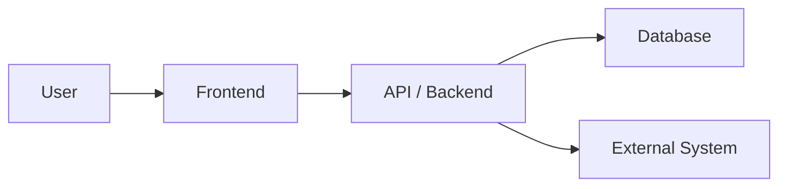
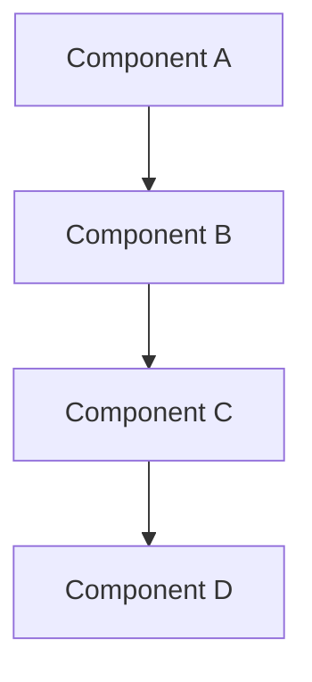
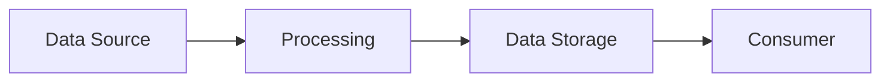
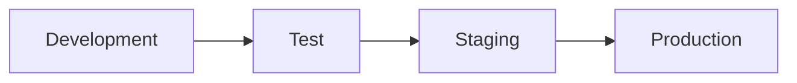

# Architecture Document

**Project:** `[Project Name]`
**Version:** `[Version]`
**Status:** `[Draft | Active | Superseded]`
**Last Updated:** `[YYYY-MM-DD]`
**Document Owner:** `[Name/Role]`

---

# 1. Executive Architecture Overview

Provide a concise description of the solution architecture.

Explain:

- What the solution does.
- The major components.
- How those components interact.
- Where the solution runs.
- Where data is stored.
- Which external systems are involved.

Keep this section understandable to both technical and non-technical
stakeholders.

---

# 2. Architecture Goals

Document the primary architectural goals.

Examples:

- Maintainability.
- Security.
- Scalability.
- Availability.
- Performance.
- Integration.
- Cost efficiency.
- Extensibility.
- Reliability.
- Auditability.

Explain why each goal is relevant to this project.

---

# 3. Architecture Principles

Document the principles used to guide implementation.

Examples:

- Separation of concerns.
- Least privilege.
- API-first design.
- Configuration over hard-coding.
- Secure-by-default.
- Reusable components.
- Automated testing.
- Infrastructure as code.
- Cloud-native design.

Only document principles actually applicable to the project.

---

# 4. High-Level Architecture

## 4.1 Architecture Diagram

Insert a high-level architecture diagram.

Prefer Mermaid where appropriate.



Replace this example with the actual architecture.

---

# 5. Solution Components

Document every significant component.

| Component     | Technology     | Responsibility | Environment     |
| ------------- | -------------- | -------------- | --------------- |
| `[Component]` | `[Technology]` | `[Purpose]`    | `[Environment]` |

For each component explain:

- Purpose.
- Responsibilities.
- Dependencies.
- Interfaces.
- Security considerations.
- Deployment model.

---

# 6. Technology Stack

Document the complete technology stack.

## 6.1 Frontend

**Technology:** `[Technology]`

**Version:** `[Version]`

**Purpose:**

`[Explain why this technology is used.]`

---

## 6.2 Backend

**Technology:** `[Technology]`

**Version:** `[Version]`

**Purpose:**

`[Explain why this technology is used.]`

---

## 6.3 Database

**Technology:** `[Technology]`

**Version:** `[Version]`

**Purpose:**

`[Explain why this database technology is used.]`

---

## 6.4 Hosting / Cloud Platform

**Platform:** `[Platform]`

**Services:**

- `[Service]`
- `[Service]`

---

## 6.5 Authentication

**Technology:** `[Technology]`

Describe:

- Authentication mechanism.
- Token/session mechanism.
- Identity provider.
- Service identities.

---

## 6.6 Authorization

Describe:

- Roles.
- Permissions.
- Resource-level authorization.
- Administrative access.
- Service-to-service permissions.

---

## 6.7 Testing

Document:

- Unit testing framework.
- Integration testing framework.
- End-to-end testing framework.
- Test runners.
- Mocking frameworks.

---

## 6.8 CI/CD

Document:

- Source control.
- Build system.
- CI platform.
- CD platform.
- Deployment environments.
- Deployment strategy.

---

## 6.9 Monitoring and Logging

Document:

- Application logging.
- Infrastructure logging.
- Monitoring.
- Alerting.
- Application performance monitoring.
- Audit logging.

---

# 7. Technology Selection Decisions

Document significant technology decisions.

For each major technology answer:

### What was selected?

`[Technology]`

### What problem does it solve?

`[Description]`

### Why was it selected?

`[Reason]`

### Alternatives considered

| Alternative     | Reason Considered | Reason Not Selected |
| --------------- | ----------------- | ------------------- |
| `[Alternative]` | `[Reason]`        | `[Reason]`          |

Only list alternatives that were actually considered.

### Benefits

- `[Benefit]`

### Limitations

- `[Limitation]`

### Cost / Licensing

`[Relevant information]`

### Security Considerations

`[Relevant information]`

### Operational Considerations

`[Relevant information]`

---

# 8. Component Architecture

Document how the major components interact.



Replace with the actual architecture.

---

# 9. Application Architecture

Describe the internal application architecture.

For example:

```text
Presentation
    ↓
API / Controllers
    ↓
Application / Services
    ↓
Domain
    ↓
Data Access
    ↓
Database
```

Explain the responsibilities of each layer.

---

# 10. Data Flow

Explain how information moves through the solution.



Document:

- Data sources.
- Data transformations.
- Data storage.
- Data consumers.
- Data retention.
- Error handling.

---

# 11. Integration Architecture

Document all external integrations.

| System     | Integration Method     | Direction            | Authentication | Purpose     |
| ---------- | ---------------------- | -------------------- | -------------- | ----------- |
| `[System]` | `[REST/API/File/etc.]` | `[Inbound/Outbound]` | `[Method]`     | `[Purpose]` |

For each integration document:

- Endpoint/system.
- Protocol.
- Authentication.
- Authorization.
- Request format.
- Response format.
- Error handling.
- Retry behavior.
- Timeout behavior.
- Rate limits where applicable.

---

# 12. API Architecture

Where applicable, document:

- API endpoints.
- HTTP methods.
- Authentication.
- Authorization.
- Request/response patterns.
- Error handling.
- Versioning.
- Rate limiting.
- Idempotency.
- Backward compatibility.

---

# 13. Authentication and Authorization Architecture

Document:

- User authentication.
- Service authentication.
- Identity provider.
- Roles.
- Permissions.
- Token management.
- Session management.
- Service identities.
- Least-privilege configuration.

---

# 14. Security Architecture

Document:

- Secrets management.
- Encryption.
- Data protection.
- Network security.
- Identity management.
- Authorization.
- Input validation.
- Output encoding.
- Dependency security.
- Logging.
- Auditability.

Do not include actual credentials or secrets.

---

# 15. Error Handling Architecture

Document:

- Application errors.
- Validation errors.
- External-system failures.
- Database failures.
- Authentication failures.
- Authorization failures.
- Retry behavior.
- Logging.
- User-facing error messages.

---

# 16. Resilience and Reliability

Document applicable mechanisms:

- Retry.
- Circuit breaker.
- Timeout.
- Queueing.
- Dead-letter handling.
- Failover.
- Recovery.
- Backup.
- Disaster recovery.

---

# 17. Performance Architecture

Document relevant performance considerations.

Include actual measurements where available.

Do not invent performance metrics.

Document:

- Expected workload.
- Performance requirements.
- Caching.
- Database optimization.
- Asynchronous processing.
- Scaling strategy.

---

# 18. Scalability

Describe:

- Horizontal scaling.
- Vertical scaling.
- Database scaling.
- Storage scaling.
- API scaling.
- Background processing scaling.

---

# 19. Deployment Architecture

Document:

- Development.
- Test.
- Staging.
- Production.

Include:



Replace with the actual deployment process.

---

# 20. Configuration Management

Document:

- Configuration files.
- Environment variables.
- Secret storage.
- Environment-specific configuration.
- Configuration deployment.

Never store actual secrets in this document.

---

# 21. Backup and Recovery

Document where applicable:

- Backup strategy.
- Backup frequency.
- Retention.
- Recovery procedure.
- Recovery Point Objective (RPO).
- Recovery Time Objective (RTO).

Only document confirmed values.

---

# 22. Audit and Compliance

Document applicable:

- Audit logging.
- Data retention.
- User activity tracking.
- Administrative activity.
- Regulatory requirements.
- Internal standards.

---

# 23. Architectural Risks

| Risk     | Impact     | Likelihood     | Mitigation     |
| -------- | ---------- | -------------- | -------------- |
| `[Risk]` | `[Impact]` | `[Likelihood]` | `[Mitigation]` |

---

# 24. Architectural Decisions

Record significant decisions.

| ID      | Decision     | Reason     | Date           |
| ------- | ------------ | ---------- | -------------- |
| ADR-001 | `[Decision]` | `[Reason]` | `[YYYY-MM-DD]` |

---

# 25. Known Architectural Limitations

Document known limitations.

- `[Limitation]`

---

# 26. Future Architectural Considerations

Document potential future improvements without presenting them as committed
functionality.

- `[Future consideration]`

---

# 27. Architecture Change History

| Version     | Date     | Change          | Author     |
| ----------- | -------- | --------------- | ---------- |
| `[Version]` | `[Date]` | `[Description]` | `[Author]` |
