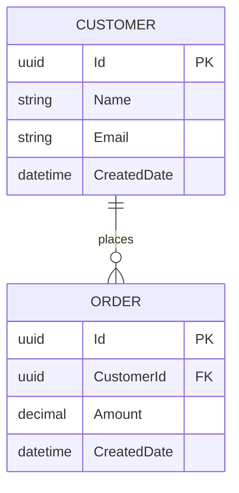
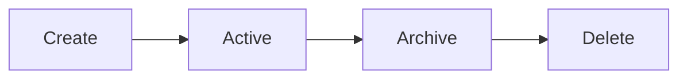

# Data Schema Documentation

**Project:** `[Project Name]`
**Version:** `[Version]`
**Status:** `[Draft | Active | Superseded]`
**Last Updated:** `[YYYY-MM-DD]`
**Document Owner:** `[Name/Role]`

---

# 1. Data Architecture Overview

Describe the application's data architecture.

Include:

- Database/platform.
- Data stores.
- Primary entities.
- Data ownership.
- Data flow.
- External data sources.

---

# 2. Data Platform

**Platform:** `[Database/Platform]`

**Version:** `[Version]`

**Hosting:** `[Hosting]`

**Environment:** `[Environment]`

Describe why this data platform is being used.

---

# 3. Entity Relationship Diagram

Use Mermaid where appropriate.

Replace with the actual schema.

---

# 4. Entities / Tables

| Entity/Table | Purpose     | Primary Key |
| ------------ | ----------- | ----------- |
| `[Entity]`   | `[Purpose]` | `[Key]`     |

---

# 5. Entity Details

## 5.1 `[Entity Name]`

**Purpose:**

`[Description]`

**Primary Key:**

`[Field]`

### Fields

| Field     | Data Type | Required | Default     | Description     |
| --------- | --------- | -------- | ----------- | --------------- |
| `[Field]` | `[Type]`  | Yes/No   | `[Default]` | `[Description]` |

### Constraints

- `[Constraint]`

### Indexes

| Index     | Fields     | Unique | Purpose     |
| --------- | ---------- | ------ | ----------- |
| `[Index]` | `[Fields]` | Yes/No | `[Purpose]` |

---

# 6. Relationships

Document all relationships.

| Parent     | Child     | Relationship | Foreign Key |
| ---------- | --------- | ------------ | ----------- |
| `[Parent]` | `[Child]` | `[1:N]`      | `[FK]`      |

Explain:

- Cascade behavior.
- Delete behavior.
- Update behavior.
- Referential integrity.

---

# 7. Foreign Keys

| Foreign Key | Table     | Column     | References         |
| ----------- | --------- | ---------- | ------------------ |
| `[FK]`      | `[Table]` | `[Column]` | `[Table].[Column]` |

---

# 8. Unique Constraints

| Constraint     | Table     | Fields     | Purpose     |
| -------------- | --------- | ---------- | ----------- |
| `[Constraint]` | `[Table]` | `[Fields]` | `[Purpose]` |

---

# 9. Enumerations / Reference Data

Document enumerated values.

## `[Enumeration Name]`

| Value     | Description     |
| --------- | --------------- |
| `[Value]` | `[Description]` |

---

# 10. Audit Fields

Document standard audit fields.

| Field        | Type        | Purpose                     |
| ------------ | ----------- | --------------------------- |
| CreatedDate  | datetime    | Record creation timestamp   |
| CreatedBy    | string/uuid | Creating user               |
| ModifiedDate | datetime    | Last modification timestamp |
| ModifiedBy   | string/uuid | Last modifying user         |

Only include fields actually implemented.

---

# 11. Soft Delete

Document whether soft deletion is used.

**Implemented:** `[Yes/No]`

If yes:

**Field:** `[Field]`

**Behavior:**

`[Description]`

---

# 12. Data Security

Document sensitive data.

| Data     | Sensitivity        | Protection     |
| -------- | ------------------ | -------------- |
| `[Data]` | `[Classification]` | `[Protection]` |

Do not include actual sensitive data.

---

# 13. Data Encryption

Document:

- Encryption at rest.
- Encryption in transit.
- Application-level encryption where applicable.
- Key management.

---

# 14. Data Retention

Document retention requirements.

| Data     | Retention  | Disposal Method |
| -------- | ---------- | --------------- |
| `[Data]` | `[Period]` | `[Method]`      |

Only document confirmed retention requirements.

---

# 15. Data Migration

Document migration requirements.

Include:

- Migration strategy.
- Existing data.
- Transformation.
- Validation.
- Rollback.

---

# 16. Seed / Reference Data

Document required initial data.

| Data Set | Purpose     | Required |
| -------- | ----------- | -------- |
| `[Data]` | `[Purpose]` | Yes/No   |

---

# 17. Stored Procedures / Functions

Where applicable:

| Name     | Purpose     | Parameters     |
| -------- | ----------- | -------------- |
| `[Name]` | `[Purpose]` | `[Parameters]` |

---

# 18. Views

Where applicable:

| View     | Purpose     |
| -------- | ----------- |
| `[View]` | `[Purpose]` |

---

# 19. Triggers

Where applicable:

| Trigger     | Table     | Purpose     |
| ----------- | --------- | ----------- |
| `[Trigger]` | `[Table]` | `[Purpose]` |

---

# 20. Data Access Architecture

Describe how application code accesses the data.

Examples:

- Entity Framework Core.
- Dapper.
- ADO.NET.
- REST API.
- Dataverse SDK.
- Microsoft Graph.
- Stored procedures.

Document:

- Repository pattern.
- ORM.
- Query strategy.
- Transaction handling.
- Connection management.

---

# 21. Transactions

Document:

- Transaction boundaries.
- Isolation levels where relevant.
- Distributed transactions where applicable.
- Rollback behavior.

---

# 22. Concurrency

Document:

- Optimistic concurrency.
- Pessimistic concurrency.
- Row versioning.
- Conflict resolution.

---

# 23. Performance Considerations

Document:

- Important indexes.
- Query optimization.
- Caching.
- Pagination.
- Large-data considerations.

Do not invent performance measurements.

---

# 24. Data Integration

Document external data sources.

| Source     | Destination     | Method     | Frequency     |
| ---------- | --------------- | ---------- | ------------- |
| `[Source]` | `[Destination]` | `[Method]` | `[Frequency]` |

---

# 25. Data Validation

Document database-level validation and application-level validation.

| Validation     | Layer                    | Rule     |
| -------------- | ------------------------ | -------- |
| `[Validation]` | `[Database/Application]` | `[Rule]` |

---

# 26. Data Lifecycle

Document:

Replace with the actual lifecycle.

---

# 27. Backup and Recovery

Document:

- Backup strategy.
- Frequency.
- Retention.
- Recovery.
- Restore testing.

---

# 28. Schema Change Process

When modifying the schema:

1. Update the schema definition.
2. Create/update the migration.
3. Update application code.
4. Update tests.
5. Update User Stories if applicable.
6. Test the migration.
7. Update this document.
8. Validate rollback where applicable.

---

# 29. Schema Validation Checklist

- [ ] All entities documented.
- [ ] All fields documented.
- [ ] Data types documented.
- [ ] Required fields documented.
- [ ] Primary keys documented.
- [ ] Foreign keys documented.
- [ ] Relationships documented.
- [ ] Indexes documented.
- [ ] Unique constraints documented.
- [ ] Enumerations documented.
- [ ] Audit fields documented.
- [ ] Security considerations documented.
- [ ] Retention documented where applicable.
- [ ] Migration documented.
- [ ] ER diagram reflects current schema.

---

# 30. Schema Change History

| Version     | Date     | Change          | Author     |
| ----------- | -------- | --------------- | ---------- |
| `[Version]` | `[Date]` | `[Description]` | `[Author]` |
