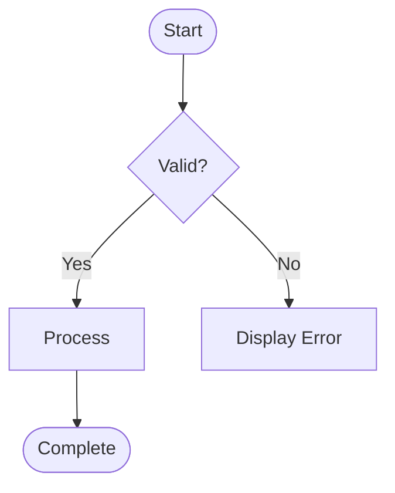

# Functional Specification

**Project:** `[Project Name]`
**Version:** `[Version]`
**Status:** `[Draft | Active | Superseded]`
**Last Updated:** `[YYYY-MM-DD]`
**Document Owner:** `[Name/Role]`

---

# 1. Purpose

Describe the purpose of the solution.

Explain:

- What problem it solves.
- Why the solution is required.
- Who will use it.
- What business outcome it supports.

---

# 2. Scope

## 2.1 In Scope

- `[Functionality]`

## 2.2 Out of Scope

- `[Functionality]`

---

# 3. Users and Personas

| ID    | Persona     | Description     | Responsibilities     |
| ----- | ----------- | --------------- | -------------------- |
| P-001 | `[Persona]` | `[Description]` | `[Responsibilities]` |

---

# 4. User Roles and Permissions

| Role     | Description     | Permissions     |
| -------- | --------------- | --------------- |
| `[Role]` | `[Description]` | `[Permissions]` |

---

# 5. Functional Requirements

Each functional requirement MUST have a unique identifier.

| ID     | Requirement     | Priority     | User Story |
| ------ | --------------- | ------------ | ---------- |
| FR-001 | `[Requirement]` | `[Priority]` | US-001     |

---

# 6. User Stories

## US-001 — `[Title]`

**As a:** `[Persona]`

**I want:** `[Functionality]`

**So that:** `[Business value]`

### Acceptance Criteria

#### AC-001

**Given:** `[Initial condition]`

**When:** `[Action]`

**Then:** `[Expected result]`

#### AC-002

**Given:** `[Initial condition]`

**When:** `[Action]`

**Then:** `[Expected result]`

### Related Requirements

- FR-001

### Related Tests

- TEST-001
- TEST-002

### Status

`[Not Started | In Progress | Complete | Blocked]`

---

## US-002 — `[Title]`

**As a:** `[Persona]`

**I want:** `[Functionality]`

**So that:** `[Business value]`

### Acceptance Criteria

#### AC-003

**Given:** `[Initial condition]`

**When:** `[Action]`

**Then:** `[Expected result]`

### Related Requirements

- FR-002

### Related Tests

- TEST-003

### Status

`[Not Started | In Progress | Complete | Blocked]`

---

# 7. Business Rules

Document business rules explicitly.

| ID     | Business Rule | Description     |
| ------ | ------------- | --------------- |
| BR-001 | `[Rule]`      | `[Description]` |

Business rules should be implemented and tested explicitly.

---

# 8. Validation Rules

| ID      | Field/Area | Validation | Error Message |
| ------- | ---------- | ---------- | ------------- |
| VAL-001 | `[Field]`  | `[Rule]`   | `[Message]`   |

---

# 9. Workflow Specifications

Document important workflows.

Example:



Replace with the actual workflow.

---

# 10. User Interface Requirements

Where applicable document:

- Screens.
- Pages.
- Forms.
- Fields.
- Buttons.
- Navigation.
- Validation.
- Accessibility.
- Responsive behavior.
- Error states.

---

# 11. API Requirements

Where applicable:

| Method | Endpoint     | Purpose     | Authentication |
| ------ | ------------ | ----------- | -------------- |
| GET    | `[Endpoint]` | `[Purpose]` | `[Method]`     |
| POST   | `[Endpoint]` | `[Purpose]` | `[Method]`     |

Document:

- Request.
- Response.
- Validation.
- Error handling.
- Authorization.
- Rate limiting.

---

# 12. Data Requirements

Document:

- Data entities.
- Required data.
- Relationships.
- Data ownership.
- Retention.
- Audit requirements.

Refer to:

```text
docs/SCHEMA.md
```

for detailed schema information.

---

# 13. Integration Requirements

| ID      | System     | Direction            | Method     | Purpose     |
| ------- | ---------- | -------------------- | ---------- | ----------- |
| INT-001 | `[System]` | `[Inbound/Outbound]` | `[Method]` | `[Purpose]` |

---

# 14. Notifications

Document:

- Email.
- Push notifications.
- In-app notifications.
- Alerts.

For each notification:

| ID      | Trigger     | Recipient     | Content         | Method     |
| ------- | ----------- | ------------- | --------------- | ---------- |
| NOT-001 | `[Trigger]` | `[Recipient]` | `[Description]` | `[Method]` |

---

# 15. Reporting Requirements

Where applicable document:

- Reports.
- Dashboards.
- Filters.
- Export functionality.
- Scheduling.
- Permissions.
- Data refresh.

---

# 16. Audit Requirements

Document:

- Actions that must be audited.
- User information.
- Timestamp.
- Before/after values.
- Administrative activity.
- Retention.

---

# 17. Security Requirements

Document:

- Authentication.
- Authorization.
- Data protection.
- Sensitive data.
- Secrets.
- Session management.
- Security logging.

---

# 18. Non-Functional Requirements

## 18.1 Performance

`[Requirements]`

## 18.2 Availability

`[Requirements]`

## 18.3 Scalability

`[Requirements]`

## 18.4 Security

`[Requirements]`

## 18.5 Maintainability

`[Requirements]`

## 18.6 Accessibility

`[Requirements]`

## 18.7 Reliability

`[Requirements]`

---

# 19. Error Scenarios

| ID      | Scenario     | Expected Behavior     |
| ------- | ------------ | --------------------- |
| ERR-001 | `[Scenario]` | `[Expected behavior]` |

---

# 20. Edge Cases

Document known edge cases.

| ID       | Edge Case | Expected Behavior |
| -------- | --------- | ----------------- |
| EDGE-001 | `[Case]`  | `[Behavior]`      |

---

# 21. Requirements Traceability

Maintain traceability between requirements, User Stories, Acceptance Criteria
and tests.

| Requirement | User Story | Acceptance Criteria | Test     | Result     |
| ----------- | ---------- | ------------------- | -------- | ---------- |
| FR-001      | US-001     | AC-001              | TEST-001 | `[Result]` |
| FR-001      | US-001     | AC-002              | TEST-002 | `[Result]` |

---

# 22. Test Summary

| Test ID  | Description     | Type                     | Result                   |
| -------- | --------------- | ------------------------ | ------------------------ |
| TEST-001 | `[Description]` | `[Unit/Integration/E2E]` | `[PASS/FAIL/NOT TESTED]` |

Tests may only be marked PASS when actually executed.

---

# 23. Known Limitations

- `[Limitation]`

---

# 24. Future Enhancements

Document possible future enhancements.

These must not be represented as current functionality.

- `[Enhancement]`

---

# 25. Specification Change History

| Version     | Date     | Change          | Author     |
| ----------- | -------- | --------------- | ---------- |
| `[Version]` | `[Date]` | `[Description]` | `[Author]` |
