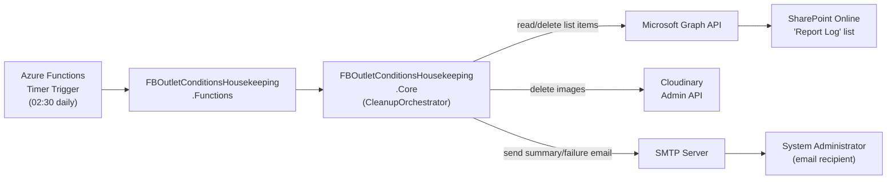
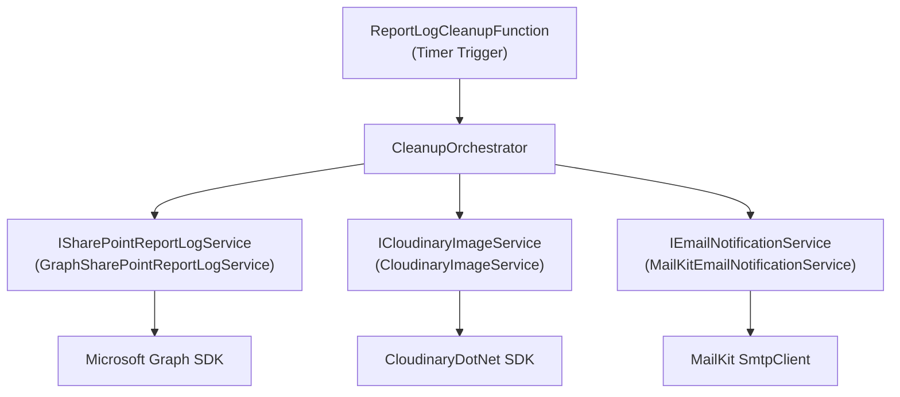
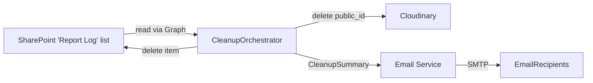
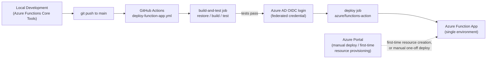

# Architecture Document

**Project:** FB Outlet Conditions Housekeeping
**Version:** 1.3
**Status:** Active
**Last Updated:** 2026-10-09
**Document Owner:** Leon Small

---

# 1. Executive Architecture Overview

The solution is a single Azure Function App, triggered daily by a timer, that
deletes aged "Report Log" entries from a SharePoint Online list and the
Cloudinary-hosted images referenced by those entries. There is no user
interface and no database of its own — SharePoint Online is the system of
record for Report Log entries, and Cloudinary is the system of record for the
associated images.

Each run:

1. Authenticates to Microsoft Graph using an Azure AD app registration.
2. Reads the Report Log list and identifies entries older than a configurable
   threshold.
3. For each eligible entry, deletes its referenced Cloudinary images first,
   and only deletes the SharePoint list item once all of its images have been
   confirmed deleted (or were never present).
4. Sends a summary (or failure) email via SMTP using MailKit.

The function runs entirely within Azure; no additional infrastructure (VMs,
containers, databases) is required.

---

# 2. Architecture Goals

- **Maintainability** — the cleanup/ordering logic is isolated in a plain
  class library independent of the Azure Functions runtime, so it can be
  understood, modified, and unit-tested without a live Azure environment.
- **Auditability** — every deletion decision (and dry-run decision) is logged
  and summarized in an email, so operators can see what happened without
  needing to query Application Insights directly.
- **Reliability** — a failure on one entry must not abort the whole run; a
  run-level failure (e.g., authentication failure) must be clearly reported.
- **Safety** — a `DryRun` mode must exist so the ordering and eligibility
  logic can be validated against production data with zero risk before being
  enabled for real deletions.
- **Security** — all credentials are externalized to configuration/Key Vault;
  the Azure AD app is granted only the Graph permissions it needs.
- **Cost efficiency** — a Consumption-plan timer function is sufficient for a
  once-daily batch job; no always-on compute is required.

---

# 3. Architecture Principles

- **Separation of concerns** — the Azure Functions project (`*.Functions`)
  contains only the timer trigger and dependency wiring; all business logic
  lives in the `*.Core` class library behind interfaces.
- **Configuration over hard-coding** — retention age, dry-run mode, email
  behavior, and all external-system connection details are configuration
  values (`IOptions<T>`), never hardcoded.
- **Secure-by-default** — `DryRun` and `EmailEnabled` default to safe values
  in documentation/examples; secrets are never embedded in source or
  documentation.
- **Least privilege** — the Azure AD app registration requests only the
  Graph permission needed to read/delete the target list's items.
- **Automated testing** — every external dependency (SharePoint/Graph,
  Cloudinary, SMTP) is abstracted behind an interface so the orchestration
  logic — including the Cloudinary-before-SharePoint ordering guarantee — is
  fully unit-testable with test doubles.

---

# 4. High-Level Architecture

## 4.1 Architecture Diagram



---

# 5. Solution Components

| Component                                     | Technology                        | Responsibility                                                         | Environment            |
| ---------------------------------------------- | ----------------------------------| --------------------------------------------------------------------------| -------------------------|
| `FBOutletConditionsHousekeeping.Functions`     | Azure Functions (.NET isolated worker) | Timer trigger entry point; DI composition root; host configuration.  | Azure Functions App     |
| `FBOutletConditionsHousekeeping.Core`          | .NET class library                | Domain models, configuration options, `CleanupOrchestrator`, and the three service interfaces/implementations (SharePoint, Cloudinary, Email). | Runs in-process within the Functions host |
| `FBOutletConditionsHousekeeping.Core.Tests`    | xUnit + Moq                       | Unit tests for orchestration logic, age filtering, URL parsing, and email formatting, using mocked external services. | Build/CI machine, local dev |
| Azure AD App Registration                      | Entra ID                          | Service principal used for Graph client-credential authentication.    | Azure AD tenant         |
| SharePoint Online "Report Log" list            | SharePoint Online                 | System of record for Report Log entries (read + deleted by this solution). | Microsoft 365 tenant |
| Cloudinary account                             | Cloudinary SaaS                   | System of record for images referenced by Report Log entries (deleted by this solution). | Cloudinary cloud    |
| SMTP server                                    | Any SMTP-compatible service       | Delivers summary/failure emails via MailKit.                            | Organization's mail infrastructure |

For each component:

- **`FBOutletConditionsHousekeeping.Functions`**
  - Purpose: host the timer trigger and wire up configuration/DI.
  - Dependencies: `FBOutletConditionsHousekeeping.Core`, Azure Functions Worker SDK.
  - Interfaces: `ReportLogCleanupFunction.RunAsync` (timer-triggered, no public API).
  - Security: holds no business logic; reads configuration/secrets only to construct typed clients.
  - Deployment model: deployed as a single Azure Function App (Consumption or Premium plan).

- **`FBOutletConditionsHousekeeping.Core`**
  - Purpose: implement the cleanup business rules (ordering, dry run, partial-failure isolation) independent of any hosting model.
  - Dependencies: Microsoft Graph SDK, Azure.Identity, CloudinaryDotNet, MailKit.
  - Interfaces: `ISharePointReportLogService`, `ICloudinaryImageService`, `IEmailNotificationService`, `ICleanupOrchestrator`.
  - Security: receives already-constructed authenticated clients; does not read raw secrets itself (secrets are bound to options and used to construct clients in the Functions composition root).
  - Deployment model: compiled into, and shipped as part of, the Functions App package.

---

# 6. Technology Stack

## 6.1 Frontend

**Technology:** Not applicable — no user interface.

---

## 6.2 Backend

**Technology:** .NET (C#), Azure Functions Isolated Worker model

**Version:** .NET 10, Azure Functions Worker SDK (latest stable compatible with .NET 10 at time of writing)

**Purpose:**

The isolated worker model is Microsoft's current recommended model for new
Azure Functions and allows the business logic to target the latest .NET
runtime independently of the Functions host process. .NET 10 was selected
per explicit direction for this project.

---

## 6.3 Database

**Technology:** Not applicable. SharePoint Online (via Microsoft Graph) is
the system of record for Report Log entries; no application-owned database
exists. See `docs/SCHEMA.md`.

---

## 6.4 Hosting / Cloud Platform

**Platform:** Microsoft Azure

**Services:**

- Azure Functions (Consumption or Premium plan)
- Azure Application Insights (function logging/telemetry, provisioned alongside the Function App)
- Azure Key Vault (recommended for secret storage, referenced from Function App settings)
- Microsoft Entra ID (Azure AD) — app registration for Graph access

---

## 6.5 Authentication

**Technology:** `Azure.Identity.ClientSecretCredential` (OAuth2 client
credentials flow) against Microsoft Entra ID, used to obtain tokens for the
Microsoft Graph SDK.

Describe:

- **Authentication mechanism:** app-only (daemon) OAuth2 client credentials grant; no user ever signs in.
- **Token/session mechanism:** tokens are acquired per-run by the Graph SDK via `ClientSecretCredential`; no tokens are persisted.
- **Identity provider:** Microsoft Entra ID (the organization's existing tenant).
- **Service identities:** a single Azure AD App Registration dedicated to this Function App (`TenantId` / `ClientId` / `ClientSecret` configuration values).

---

## 6.6 Authorization

- **Roles:** none — this is a single unattended service identity with one job.
- **Permissions:** the App Registration is granted the Microsoft Graph
  **application** permission `Sites.ReadWrite.All` (or a narrower
  site-scoped permission via a Graph application access policy, which is
  recommended where tenant policy allows) with admin consent.
- **Resource-level authorization:** scoping to only the target site/list is
  achieved via configuration (`SiteId`/`ListId`), and ideally via a Graph
  application access policy restricting the app to that site.
- **Administrative access:** managing the App Registration's credentials and
  Graph permissions requires Azure AD administrator privileges; this is an
  operational concern documented in `docs/SETUP-GUIDE.md`, not something the
  application itself manages.
- **Service-to-service permissions:** Cloudinary access is authorized via API
  key/secret scoped to the Cloudinary account/cloud used for this
  application's images; SMTP access is authorized via the configured SMTP
  account credentials.

---

## 6.7 Testing

- **Unit testing framework:** xUnit.
- **Mocking framework:** Moq — used to substitute `ISharePointReportLogService`, `ICloudinaryImageService`, and `IEmailNotificationService` so the orchestrator's ordering and branching logic is tested without any live external call.
- **Integration/E2E testing:** not implemented — see Section 23 (Known Architectural Limitations) and `docs/SPECIFICATION.md` Section 23 for rationale (no live tenant/Cloudinary/SMTP credentials available in this development environment).

---

## 6.8 CI/CD

- **Source control:** Git (this repository).
- **Build system:** `dotnet build` / `dotnet test` via the .NET 10 SDK.
- **CI/CD platform:** GitHub Actions, via `.github/workflows/deploy-function-app.yml`. On every push to `main` (touching `src/`, `tests/`, or the solution file) or manual dispatch, the workflow restores, builds (`Release`), and runs the full test suite in a `build-and-test` job; a separate `deploy` job then publishes and deploys the Functions project to the target Azure Function App, but only if `build-and-test` succeeded.
- **Deployment authentication:** Azure AD OIDC federated credentials (`azure/login`) scoped to this repository's `main` branch / `production` GitHub Environment — no client secret or publish-profile password is stored in GitHub (see ADR-006).
- **Environment approvals:** the `deploy` job targets the GitHub `production` Environment, which can optionally require manual reviewer approval before a deployment proceeds.
- **Manual/CLI deployment:** remains fully supported as an alternative (`func azure functionapp publish`, Azure CLI zip deploy, or Visual Studio/VS Code publish) — see `docs/SETUP-GUIDE.md` Section 16.2 — and is the path used for the very first deployment that provisions the Azure resources the workflow later deploys into.

---

## 6.9 Monitoring and Logging

- **Application logging:** `Microsoft.Extensions.Logging.ILogger`, flowing to Azure Application Insights via the Functions host's built-in classic telemetry mode (`host.json` `"telemetryMode": "applicationInsights"` — see ADR-009), requiring no custom instrumentation code.
- **Monitoring/alerting:** standard Azure Functions/Application Insights monitoring (failure count, invocation duration); confirmed working via a live invocation appearing in Monitor → Invocations after ADR-009. No custom alert rules are created by this change.
- **Audit logging:** see `docs/SPECIFICATION.md` Section 16.

---

# 7. Technology Selection Decisions

### SharePoint access — Microsoft Graph SDK with Azure AD App Registration (client secret)

**What was selected?** `Microsoft.Graph` SDK + `Azure.Identity.ClientSecretCredential`.

**What problem does it solve?** Unattended, least-privilege read/delete
access to a SharePoint Online list without a signed-in user.

**Why was it selected?** It is the Microsoft-recommended, actively supported
way to access SharePoint Online data programmatically; CSOM/SOAP APIs are
legacy. Explicitly chosen over Managed Identity for this project because an
App Registration with a client secret is simpler to set up initially and
does not require the Function App's managed identity to be granted Graph
application permissions by a tenant administrator ahead of first deployment.

**Alternatives considered**

| Alternative                              | Reason Considered                                   | Reason Not Selected                                                                 |
| ------------------------------------------| ------------------------------------------------------| ---------------------------------------------------------------------------------------|
| System-assigned Managed Identity + Graph  | Avoids managing/rotating a client secret.            | Explicitly not chosen for this project (user decision) in favor of the simpler, more immediately deployable App Registration + client secret pattern; documented here as a viable future hardening step. |
| SharePoint CSOM/REST with user credentials | Simpler historically in older SharePoint solutions. | Requires a stored user identity/password, is legacy, and does not fit an unattended daemon pattern as cleanly as app-only Graph auth. |

**Benefits:** actively maintained SDK, strongly typed models, consistent
Graph throttling/retry guidance available.

**Limitations:** client secret must be rotated periodically and stored
securely (Key Vault recommended).

**Cost/Licensing:** no additional licensing cost beyond the existing
Microsoft 365/Entra ID tenant.

**Security considerations:** least-privilege Graph permission scoped to the
target site where tenant policy allows; secret stored in Key Vault, never in
source control.

**Operational considerations:** client secret expiry must be tracked and
rotated before expiry to avoid run failures.

---

### Cloudinary access — CloudinaryDotNet SDK

**What was selected?** `CloudinaryDotNet` (official .NET SDK).

**What problem does it solve?** Deleting images by `public_id` via
Cloudinary's Admin API `destroy` operation.

**Why was it selected?** It is Cloudinary's officially maintained .NET SDK,
avoiding hand-rolled HTTP/signature code for the Admin API.

**Alternatives considered**

| Alternative                      | Reason Considered                     | Reason Not Selected                                                    |
| -----------------------------------| -----------------------------------------| --------------------------------------------------------------------------|
| Raw HTTPS calls to Cloudinary Admin API | Avoids an extra dependency.      | Requires manually implementing Cloudinary's request signing; the official SDK already does this correctly and is actively maintained. |

**Benefits:** handles request signing, retries are straightforward to layer on top, strongly typed responses (`DeletionResult`).

**Limitations:** adds a third-party dependency; Cloudinary account-level rate limits apply (not expected to be a concern at the described daily volume).

**Cost/Licensing:** governed by the organization's existing Cloudinary plan; no additional licensing introduced by this change.

**Security considerations:** API key/secret stored in configuration/Key Vault only.

**Operational considerations:** none beyond normal Cloudinary account management.

---

### Email delivery — MailKit (SMTP)

**What was selected?** `MailKit` (with `MimeKit`).

**What problem does it solve?** Sending the HTML summary/failure
notification emails.

**Why was it selected?** Explicitly chosen for this project over Microsoft
Graph `sendMail` or a third-party email API (e.g., SendGrid) so that email
delivery uses standard SMTP and is not coupled to the same Graph application
permission set used for SharePoint access, and does not introduce a
dependency on a third-party email-sending SaaS.

**Alternatives considered**

| Alternative                  | Reason Considered                                    | Reason Not Selected                                                             |
| -------------------------------| --------------------------------------------------------| -------------------------------------------------------------------------------- |
| Microsoft Graph `sendMail`     | Would reuse the same Graph app/credentials already needed for SharePoint. | Not selected for this project; MailKit/SMTP was explicitly requested to keep email delivery decoupled from the Graph app's permission set. |
| SendGrid (Azure Functions output binding) | Simple Azure-native binding.               | Not selected; introduces a third-party SaaS dependency and API key that MailKit/SMTP avoids. |

**Benefits:** works with any SMTP provider (Office 365 SMTP AUTH, internal relay, etc.), no coupling to Graph permissions.

**Limitations:** requires SMTP credentials to be configured and kept valid; some mail providers require app passwords or OAuth2 SMTP depending on tenant policy (documented in `docs/SETUP-GUIDE.md`).

**Cost/Licensing:** MailKit is MIT-licensed, no cost; SMTP relay cost/availability depends on the organization's existing mail infrastructure.

**Security considerations:** SMTP username/password stored in configuration/Key Vault only; MailKit is configured to use SSL/TLS.

**Operational considerations:** SMTP server/firewall must permit outbound connections from the Function App's network.

---

### .NET 10 Isolated Worker model

**What was selected?** .NET 10, Azure Functions isolated worker process model.

**What problem does it solve?** Running the Function App on the latest .NET
runtime with full control over the DI container and middleware pipeline.

**Why was it selected?** Explicitly requested for this project; the isolated
worker model is Microsoft's forward path for all new Azure Functions
development (the in-process model does not support versions beyond .NET 8
and is being phased out).

**Alternatives considered**

| Alternative              | Reason Considered                     | Reason Not Selected                                              |
| ---------------------------| -----------------------------------------| ----------------------------------------------------------------- |
| .NET 8 Isolated Worker (LTS) | Longer official long-term support window. | Not selected; .NET 10 was explicitly requested for this project. |

**Benefits:** latest language/runtime features and performance improvements; full DI/middleware control.

**Limitations:** .NET 10 is a Standard Term Support (STS) release with a shorter support window than an LTS release — tracked as an operational consideration for future upgrade planning.

**Cost/Licensing:** none.

**Security considerations:** none beyond keeping the SDK/runtime patched.

**Operational considerations:** confirm the target Azure Functions hosting plan/region supports the .NET 10 isolated worker runtime before production deployment (see `docs/SETUP-GUIDE.md`).

---

# 8. Component Architecture



---

# 9. Application Architecture

```text
Azure Functions Host (Isolated Worker)
    ↓
ReportLogCleanupFunction (Timer Trigger — thin entry point)
    ↓
CleanupOrchestrator (Core — business rules: age filter, ordering, dry run, partial-failure isolation, summary building)
    ↓
Service Interfaces (Core — ISharePointReportLogService / ICloudinaryImageService / IEmailNotificationService)
    ↓
Service Implementations (Core — Graph SDK / CloudinaryDotNet / MailKit)
    ↓
External Systems (SharePoint Online / Cloudinary / SMTP server)
```

- **`ReportLogCleanupFunction`:** the Azure Functions timer trigger. Resolves
  `ICleanupOrchestrator` from DI and invokes it; contains no business logic
  itself.
- **`CleanupOrchestrator`:** implements the full business workflow —
  retrieves eligible entries, enforces the Cloudinary-before-SharePoint
  ordering rule, honors `DryRun`, isolates per-entry failures, and builds the
  `CleanupSummary` that is handed to the email service.
- **Service interfaces/implementations:** each external system is wrapped
  behind a narrow interface so the orchestrator can be unit-tested with test
  doubles, and so each integration's SDK-specific details stay out of the
  business logic.

---

# 10. Data Flow



- **Data sources:** SharePoint Report Log list items (fields: configured
  date field, up to 5 configured Cloudinary image URL fields).
- **Data transformations:** Cloudinary `public_id` is parsed out of each
  stored image URL; list items are classified as eligible/ineligible by
  comparing the configured date field to `UtcNow - EntryAgeDays`.
- **Data storage:** none owned by this application; SharePoint and
  Cloudinary remain the sources of truth until deleted.
- **Data consumers:** the email recipients configured in `EmailRecipients`;
  Application Insights (logs).
- **Data retention:** governed by `EntryAgeDays`; see `docs/SCHEMA.md`.
- **Error handling:** see `docs/SPECIFICATION.md` Section 19 (Error
  Scenarios).

---

# 11. Integration Architecture

| System             | Integration Method                  | Direction | Authentication                         | Purpose                                      |
| ---------------------| ---------------------------------------| -----------| ------------------------------------------| ------------------------------------------------|
| SharePoint Online   | Microsoft Graph SDK (HTTPS/REST)     | Outbound  | Azure AD client-credentials (app-only) | Read and delete Report Log list items.       |
| Cloudinary          | CloudinaryDotNet SDK (HTTPS/REST)    | Outbound  | API key/secret                         | Delete images referenced by Report Log entries. |
| SMTP server         | MailKit `SmtpClient` (SMTP/TLS)      | Outbound  | SMTP username/password                 | Deliver summary/failure notification emails. |

For each integration:

- **Protocol:** all three integrations are synchronous HTTPS (or SMTP/TLS) calls awaited sequentially within a single function invocation.
- **Request/response format:** Graph SDK strongly typed models (`ListItem`); CloudinaryDotNet strongly typed `DeletionParams`/`DeletionResult`; MailKit `MimeMessage`.
- **Error handling:** see `docs/SPECIFICATION.md` Section 19.
- **Retry behavior:** relies on each SDK's built-in transient-fault handling (Graph SDK's default retry handler; CloudinaryDotNet's underlying `HttpClient`). No additional custom retry/circuit-breaker policy is implemented in this version — documented as a future consideration (Section 26).
- **Timeout behavior:** default `HttpClient`/SDK timeouts are used; not separately configured.
- **Rate limits:** Graph and Cloudinary both apply tenant/account-level throttling; not expected to be reached at the described daily volume.

---

# 12. API Architecture

Not applicable — this solution exposes no inbound API of its own (see
`docs/SPECIFICATION.md` Section 11 for the outbound APIs it consumes).

---

# 13. Authentication and Authorization Architecture

See Sections 6.5 and 6.6 above. In summary: app-only Azure AD authentication
to Microsoft Graph via client secret; API key/secret authentication to
Cloudinary; username/password SMTP authentication via MailKit. There is no
end-user authentication anywhere in this solution.

---

# 14. Security Architecture

- **Secrets management:** `ClientSecret` (Azure AD), `CloudinaryApiSecret`,
  and `SmtpPassword` are supplied via Azure Function App Configuration,
  ideally as Key Vault references (`@Microsoft.KeyVault(...)`), and via
  `local.settings.json` (gitignored) for local development only.
- **Encryption:** all external calls use HTTPS/TLS (Graph, Cloudinary) or
  SMTP over TLS (MailKit, configured with `SecureSocketOptions.StartTls` or
  equivalent).
- **Data protection:** no additional at-rest encryption is implemented by
  this application; it relies on SharePoint Online's, Cloudinary's, and the
  mail provider's own data protection.
- **Network security:** standard Azure Functions outbound networking; no
  VNet integration is required by this version (documented as a future
  consideration if the organization mandates private networking).
- **Identity management:** see Section 13.
- **Input validation:** Cloudinary image URLs are validated as well-formed
  absolute URIs before `public_id` extraction is attempted; invalid URLs are
  treated as a per-entry failure (BR-001/ERR-005), not as an application
  crash.
- **Output encoding:** values interpolated into the HTML summary email
  (e.g., item IDs, error messages) are HTML-encoded to avoid malformed or
  injected markup in the rendered email.
- **Dependency security:** all third-party packages (`Microsoft.Graph`,
  `Azure.Identity`, `CloudinaryDotNet`, `MailKit`) are sourced from NuGet.org
  official packages only.
- **Logging:** secret values are never logged; only identifiers (item IDs,
  `public_id`s, email addresses configured for notification) and exception
  messages are logged.
- **Auditability:** see `docs/SPECIFICATION.md` Section 16.

---

# 15. Error Handling Architecture

- **Application errors:** caught at the per-entry level inside
  `CleanupOrchestrator` so one entry's failure (e.g., a Cloudinary deletion
  exception) is recorded in the summary and does not stop the run.
- **Validation errors:** malformed configuration (e.g., `EntryAgeDays` <= 0,
  or `EmailEnabled = true` with no valid `EmailRecipients`) is validated via
  `IValidateOptions<T>` at startup, failing fast rather than failing deep
  into a run.
- **External-system failures:** authentication failures (Graph token
  acquisition, Cloudinary/SMTP connection failures) are run-level — they
  abort the whole run, are logged, trigger a failure email (if enabled), and
  the exception is rethrown so the Azure Functions host marks the invocation
  as failed (visible in Application Insights/monitoring).
- **Retry behavior:** none implemented beyond each SDK's own default
  transient-fault handling (see Section 11).
- **Logging:** `ILogger<T>` is used throughout; structured log properties
  include the SharePoint item ID and/or Cloudinary `public_id` being
  processed.

---

# 16. Resilience and Reliability

- **Retry:** relies on SDK defaults (Section 11); no custom Polly policies
  are implemented in this version (Section 26, future consideration).
- **Partial-failure isolation:** per BR-002, one entry's failure does not
  abort the run for other entries.
- **Idempotent-friendly recovery:** if a SharePoint delete fails after its
  Cloudinary images were already deleted, the next day's run finds the same
  (now even older) entry with no remaining images to delete, and will
  proceed straight to the SharePoint delete — see ERR-003.
- **Failover/disaster recovery:** not applicable; this is a stateless batch
  job with no persisted state of its own. A missed run (platform outage) is
  covered by the next scheduled run.
- **Backup:** not applicable — no application-owned data store exists.

---

# 17. Performance Architecture

- **Expected workload:** tens to low hundreds of Report Log entries
  evaluated per day (see `docs/SPECIFICATION.md` Section 18.1). No actual
  production measurements exist yet — this is an estimate, not a measured
  value.
- **Caching:** none required for this workload.
- **Asynchronous processing:** all I/O (Graph, Cloudinary, SMTP) uses
  `async`/`await`, but entries are processed sequentially (not in parallel)
  within a run, per the simplicity/ordering-clarity decision in Section 7.
- **Scaling strategy:** not a design driver for a once-daily batch job of
  this expected size; see Known Limitations (Section 25) if volume grows.

---

# 18. Scalability

- **Horizontal scaling:** not applicable/not required — a single timer
  invocation per day performs all work; Azure Functions Consumption plan
  scaling is not a relevant concern for a singleton timer trigger.
- **Database scaling:** not applicable (no application-owned database).
- **Storage scaling:** governed entirely by SharePoint Online and Cloudinary
  account limits, not by this application.
- **Background processing scaling:** if entry volume grows significantly,
  introducing bounded concurrency (see Future Enhancements) would be the
  first scaling lever.

---

# 19. Deployment Architecture



Two deployment paths reach the single production Azure Function App — full
step-by-step instructions for both are in `docs/SETUP-GUIDE.md` Section 16:

- **GitHub Actions (recommended for ongoing deployments):** a push to
  `main` triggers `.github/workflows/deploy-function-app.yml`, which builds
  and tests the solution, then — only if that succeeds — authenticates to
  Azure via OIDC and deploys the published package.
- **Azure Portal / CLI (manual):** used for the initial creation of the
  Azure resources (Resource Group, Storage Account, Function App,
  Application Insights, Key Vault) that the GitHub Actions workflow later
  deploys into, and remains available as a fallback one-off deployment
  method.

Only a single deployed environment (the production Azure Function App) is in
scope for this change; no separate Dev/Test/Staging Azure environments have
been provisioned or are described by this architecture. Multi-environment
promotion is a future consideration (Section 26) if the organization
requires it.

---

# 20. Configuration Management

All configuration is supplied via Azure Function App Application Settings
(environment variables) and, for local development, `local.settings.json`
(which is excluded from source control via `.gitignore`; an example file
`local.settings.json.example` is committed instead).

| Setting                  | Purpose                                                                  |
| ---------------------------| ---------------------------------------------------------------------------|
| `Cleanup:EntryAgeDays`     | How old (in days) a Report Log entry must be to become eligible for deletion. |
| `Cleanup:DryRun`           | When `true`, evaluates and logs/emails without deleting anything.       |
| `Cleanup:TimerSchedule`    | CRON expression for the timer trigger (default `0 30 2 * * *` — 02:30 daily). |
| `Cleanup:MaxPageSize`      | Page size used when paging through Graph list-item results.             |
| `SharePoint:TenantId`      | Azure AD tenant ID.                                                       |
| `SharePoint:ClientId`      | Azure AD App Registration (application) ID.                              |
| `SharePoint:ClientSecret`  | Azure AD App Registration client secret (Key Vault reference recommended). |
| `SharePoint:SiteId`        | Graph site ID hosting the Report Log list.                                |
| `SharePoint:ListId`        | Graph list ID for the Report Log list.                                   |
| `SharePoint:DateFieldInternalName` | Internal name of the list column used to determine entry age.   |
| `SharePoint:ImageUrlFieldInternalNames` | Comma-separated list (up to 5) of internal column names holding Cloudinary image URLs. |
| `Cloudinary:CloudName`     | Cloudinary cloud name.                                                    |
| `Cloudinary:ApiKey`        | Cloudinary API key.                                                       |
| `Cloudinary:ApiSecret`     | Cloudinary API secret (Key Vault reference recommended).                 |
| `Email:EmailEnabled`       | Controls whether summary/failure emails are sent.                       |
| `Email:EmailRecipients`    | Comma-separated list of recipient email addresses.                      |
| `Email:EmailFromAddress`   | The "From" address used for sent emails.                                 |
| `Email:SmtpHost`           | SMTP server hostname.                                                     |
| `Email:SmtpPort`           | SMTP server port.                                                         |
| `Email:SmtpUseSsl`         | Whether to use implicit SSL (vs. STARTTLS) when connecting.             |
| `Email:SmtpUsername`       | SMTP authentication username.                                            |
| `Email:SmtpPassword`       | SMTP authentication password (Key Vault reference recommended).         |

No secrets are stored in this document, in source control, or in
`docs/SETUP-GUIDE.md` beyond placeholder examples.

---

# 21. Backup and Recovery

Not applicable — this application owns no persistent data store. The only
"recovery" consideration is SharePoint Online's native Recycle Bin, which
provides a time-boxed safety net after a list item delete, governed entirely
by Microsoft 365 tenant policy and outside this application's control.

---

# 22. Audit and Compliance

See `docs/SPECIFICATION.md` Section 16 (Audit Requirements). No specific
regulatory compliance requirement has been identified for this project.

---

# 23. Architectural Risks

| Risk                                                                 | Impact                                            | Likelihood | Mitigation                                                                                   |
| ------------------------------------------------------------------------| -----------------------------------------------------| ------------| -------------------------------------------------------------------------------------------- |
| Azure AD App Registration client secret expires unnoticed             | All runs fail (authentication failure), nightly for every run until rotated. | Medium | Failure email is sent on every failed run (if `EmailEnabled`); document secret expiry tracking in `docs/SETUP-GUIDE.md`. |
| SharePoint item deleted successfully but failure occurs sending the summary email | Operators are unaware a run even occurred, though the cleanup itself succeeded. | Low | Email failures are logged separately from cleanup failures (ERR-004); Application Insights remains the authoritative log regardless of email delivery. |
| A Cloudinary image URL field format changes upstream (e.g., new URL structure) | `public_id` parsing fails for new entries, causing those entries to be recorded as failed indefinitely. | Low-Medium | Parsing failures are visible per-entry in the summary email, not silent; `docs/SETUP-GUIDE.md` documents the expected URL format. |
| .NET 10 is an STS (not LTS) release | Shorter official support window than an LTS release. | Low (operational, long-term) | Tracked in Section 7/Known Limitations; a future migration to the next LTS release (.NET 12, when available) should be planned. |

---

# 24. Architectural Decisions

| ID      | Decision                                                                        | Reason                                                                                         | Date       |
| ------- | ------------------------------------------------------------------------------- | ------------------------------------------------------------------------------------------------| ------------|
| ADR-001 | Separate business logic into a `*.Core` class library independent of the Azure Functions host. | Enables full unit testing of the Cloudinary-before-SharePoint ordering rule without a live Azure Functions runtime. | 2026-10-08 |
| ADR-002 | Use Azure AD App Registration with client secret (not Managed Identity) for Graph access. | Explicit user decision — simpler initial setup for an unattended daemon; documented Managed Identity as a future hardening option. | 2026-10-08 |
| ADR-003 | Use MailKit/SMTP (not Graph `sendMail` or SendGrid) for email delivery. | Explicit user decision — decouples email delivery from the Graph app's permission set and avoids a third-party email SaaS dependency. | 2026-10-08 |
| ADR-004 | Process eligible entries sequentially within a run (no parallelism). | Simplicity and predictable ordering/logging for the expected daily volume; documented as a future enhancement if volume grows. | 2026-10-08 |
| ADR-005 | Perform age-eligibility filtering client-side after retrieving list items, rather than via a Graph server-side `$filter`. | The target list's date field indexing status cannot be guaranteed in advance; client-side filtering works reliably regardless of indexing, at some efficiency cost for very large lists. | 2026-10-08 |
| ADR-006 | Use GitHub Actions with Azure AD OIDC federated credentials (not a stored publish profile or client secret) for CI/CD deployment authentication. | Avoids storing any long-lived Azure credential in GitHub; GitHub issues a short-lived token per workflow run, consistent with the least-privilege/secure-by-default principles already applied elsewhere in this project (Section 3). | 2026-10-08 |
| ADR-007 | Reuse the user-assigned managed identity (`oidc-msi-a7ef`) that Azure Portal's Deployment Center had already created and granted `Website Contributor` on the Function App, rather than creating a second, separate App Registration for the project's own GitHub Actions workflow. | Avoids a redundant identity with its own role assignment to manage; the existing identity's federated credential model works identically for both use cases — it only needed a second federated credential added (ADR-008) to also match the workflow's actual OIDC subject. | 2026-10-09 |
| ADR-008 | Register a second federated credential on that managed identity, scoped to subject `environment:production`, in addition to the existing `ref:refs/heads/main`-scoped one. | GitHub Actions emits a different OIDC token subject when a job declares a `environment:`, as the `deploy` job does — confirmed empirically when the first live run failed `azure/login` with only the branch-scoped credential in place; both credentials now coexist so either trigger path authenticates successfully. | 2026-10-09 |
| ADR-009 | Revert `host.json`'s `telemetryMode` from `"OpenTelemetry"` to the classic `"applicationInsights"` mode, and remove the corresponding custom OpenTelemetry wiring (and NuGet packages) from `Program.cs`. | A live run on the real Function App sent its summary email successfully but produced zero invocation telemetry in Application Insights (confirmed via direct KQL query: no `requests` and no `traces` for the function at all, only host/Kudu admin calls). The custom OpenTelemetry pipeline only configured tracing, never logging, and did not instrument the timer trigger's invocations. Classic mode is Azure Functions' long-standing, fully-supported default and requires no application code — the host instruments every trigger type and forwards `ILogger` output automatically. | 2026-10-09 |

---

# 25. Known Architectural Limitations

- No custom retry/circuit-breaker policies are layered on top of the Graph,
  Cloudinary, or MailKit SDK defaults.
- No VNet/private networking has been configured; the Function App uses
  standard public outbound networking.
- Only a single deployment environment is described; no Dev/Test/Staging
  promotion path exists yet.
- Entries are processed sequentially; see `docs/SPECIFICATION.md` Section 23
  for the related functional limitation.

---

# 26. Future Architectural Considerations

- Introduce Polly-based retry/circuit-breaker policies around the Graph,
  Cloudinary, and SMTP calls.
- Migrate from Azure AD App Registration + client secret to the Function
  App's system-assigned Managed Identity for Graph access, removing the
  client-secret rotation burden.
- Introduce bounded concurrency for processing eligible entries if daily
  volume grows substantially.
- Add Dev/Test/Staging environment promotion if the organization requires
  it, including a corresponding GitHub Actions environment/approval stage
  per environment.

---

# 27. Architecture Change History

| Version | Date       | Change                                                                  | Author      |
| ------- | ---------- | -------------------------------------------------------------------------| -------------|
| 1.0     | 2026-10-08 | Initial architecture for new project.                                   | Claude Code |
| 1.1     | 2026-10-08 | Documented the GitHub Actions CI/CD pipeline (Section 6.8, ADR-006) and expanded the deployment architecture (Section 19) to cover both GitHub Actions and Azure Portal/CLI deployment paths. | Claude Code |
| 1.2     | 2026-10-09 | Recorded ADR-007/ADR-008 (reused managed identity, added environment-scoped federated credential) following the first successful live deployment via GitHub Actions; removed the now-resolved "not yet executed end-to-end" limitation and future consideration. | Claude Code |
| 1.3     | 2026-10-09 | Bug fix: recorded ADR-009 reverting `host.json` telemetry mode from OpenTelemetry to classic Application Insights, after a live run showed zero invocation telemetry despite the function executing successfully; updated Section 6.9 accordingly. | Claude Code |
