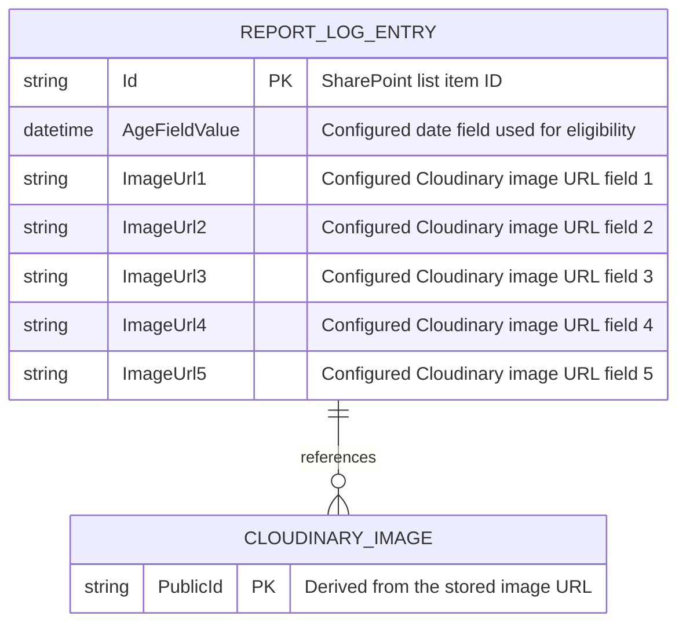
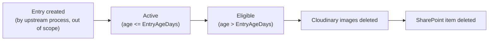

# Data Schema Documentation

**Project:** FB Outlet Conditions Housekeeping
**Version:** 1.1
**Status:** Active
**Last Updated:** 2026-10-08
**Document Owner:** Leon Small

---

# 1. Data Architecture Overview

This application owns no database of its own. It reads and deletes data in
two external systems:

- **SharePoint Online** — the "Report Log" list is the system of record for
  Report Log entries. This application only reads/deletes existing list
  items; it never creates or updates one.
- **Cloudinary** — the system of record for the images referenced by Report
  Log entries, identified by `public_id`. This application only deletes
  existing images; it never uploads one.

Because the exact SharePoint list column internal names are tenant/site
specific and were not available to inspect in this environment, every field
name this application depends on is a configuration value (see Section 20
and `docs/ARCHITECTURE.md` Section 20) rather than a hardcoded assumption.
This is documented explicitly as **Not verified against the live tenant** —
see Section 29.

---

# 2. Data Platform

**Platform:** SharePoint Online (Microsoft 365) accessed via Microsoft Graph;
Cloudinary SaaS accessed via the Cloudinary Admin API.

**Version:** Microsoft Graph v1.0; Cloudinary Admin API (current, via
CloudinaryDotNet SDK).

**Hosting:** Microsoft 365 tenant (SharePoint Online); Cloudinary cloud.

**Environment:** Production tenant/account as configured; no separate
Dev/Test SharePoint site or Cloudinary cloud is described by this
documentation (see `docs/ARCHITECTURE.md` Section 19).

This application does not introduce a relational/NoSQL database — the
external SaaS systems above are leveraged directly to avoid duplicating data
ownership.

---

# 3. Entity Relationship Diagram



A Report Log entry references zero to five Cloudinary images, each by a
stored URL field. There is no reverse relationship — Cloudinary has no
knowledge of which SharePoint item references a given image; the
association exists only because the URL is stored on the SharePoint item.

---

# 4. Entities / Tables

| Entity/Table         | Purpose                                                              | Primary Key                      |
| ------------------------| -------------------------------------------------------------------------| ------------------------------------|
| Report Log (SharePoint list) | Stores one entry per logged "FB Outlet Condition" report, including up to 5 Cloudinary image URLs. | SharePoint list item ID (`Id`, Graph `ListItem.Id`) |
| Cloudinary Image      | An image asset uploaded to Cloudinary and referenced by a Report Log entry. | `public_id` (derived, not stored independently) |

---

# 5. Entity Details

## 5.1 Report Log (SharePoint list item)

**Purpose:**

Represents a single logged report (e.g., an FB outlet condition report)
that becomes eligible for deletion once older than the configured retention
period.

**Primary Key:**

Graph `ListItem.Id` (string).

### Fields

| Field                                         | Data Type              | Required | Default        | Description                                                                 |
| ------------------------------------------------| --------------------------| ----------| ----------------| ---------------------------------------------------------------------------- |
| `Id`                                           | string                  | Yes      | n/a            | SharePoint list item identifier (Graph `ListItem.Id`).                      |
| `<SharePoint:DateFieldInternalName>` (configurable) | datetime            | Yes      | n/a            | The field used to determine entry age; compared against `UtcNow - EntryAgeDays`. Internal column name is supplied via configuration, not hardcoded, because the actual Report Log list schema was not available to inspect in this environment. |
| `<SharePoint:ImageUrlFieldInternalNames>` (configurable, up to 5) | string (URL) | No (0–5 populated) | empty | Up to 5 configured column internal names, each holding either an empty value or an absolute Cloudinary delivery URL for one referenced image. |

### Constraints

- A Report Log entry MAY have between 0 and 5 populated Cloudinary image URL
  fields; fields beyond those configured are not read by this application.
- The date field used for age comparison MUST be a valid SharePoint
  date/date-time column; behavior for a null/blank value on that field is
  that the entry is treated as not eligible (cannot be reliably aged) and is
  logged as skipped, not deleted and not treated as a run failure.

### Indexes

| Index                              | Fields                              | Unique | Purpose                                                                 |
| --------------------------------------| ----------------------------------------| --------| ---------------------------------------------------------------------------|
| Not currently verified               | Configured date field               | No     | An index on the configured date field would allow efficient server-side (Graph `$filter`) eligibility filtering; this application does not currently require or assume one (see `docs/ARCHITECTURE.md` ADR-005). |

---

## 5.2 Cloudinary Image

**Purpose:**

An image asset stored in Cloudinary, referenced by a Report Log entry's URL
field, and deleted by this application once its owning entry becomes
eligible.

**Primary Key:**

`public_id` — not stored directly on the SharePoint item; derived at
runtime by parsing the stored delivery URL (see Section 17 /
`ICloudinaryImageService`).

### Fields

| Field       | Data Type | Required | Default | Description                                                        |
| -------------| ------------| ----------| ---------| ---------------------------------------------------------------------|
| `PublicId`  | string    | Yes      | n/a     | Cloudinary asset identifier, parsed from the stored delivery URL's path (the path segment(s) after the version/transformation segment, with the file extension removed). Confirmed for the production account (Dynamic Folder Mode, asset folder `crane_fb/images`) to be a bare identifier with no folder prefix — see Section 17. |

### Constraints

- A URL that cannot be parsed into a valid `public_id` is treated as a
  per-entry failure (ERR-005 in `docs/SPECIFICATION.md`), not a crash.

### Indexes

Not applicable — Cloudinary is a SaaS asset store, not a relational table.

---

# 6. Relationships

| Parent           | Child            | Relationship | Foreign Key                                             |
| -------------------| -------------------| --------------| ----------------------------------------------------------|
| Report Log entry  | Cloudinary Image | 1:N (0–5)    | None formally — association exists only via the stored URL value on the Report Log entry's configured image URL fields. |

Explain:

- **Cascade behavior:** enforced entirely in application logic (BR-001):
  all referenced Cloudinary images must be deleted before the parent Report
  Log entry is deleted.
- **Delete behavior:** Cloudinary images are deleted individually by
  `public_id`; the SharePoint item delete is a single Graph item delete
  call, issued only after all image deletes for that entry succeeded (or
  there were none).
- **Update behavior:** not applicable — this application never updates a
  Report Log entry or a Cloudinary image, only deletes.
- **Referential integrity:** not enforced by either system automatically;
  it is the entire purpose of the ordered-deletion business rule (BR-001)
  implemented in `CleanupOrchestrator`.

---

# 7. Foreign Keys

Not applicable — there is no database-enforced foreign key between
SharePoint and Cloudinary. See Section 6.

---

# 8. Unique Constraints

Not applicable beyond each external system's own native uniqueness (Graph
`ListItem.Id` is unique per list; Cloudinary `public_id` is unique per
cloud).

---

# 9. Enumerations / Reference Data

## `CleanupItemStatus` (application-internal, `FBOutletConditionsHousekeeping.Core.Models`)

| Value              | Description                                                                    |
| ----------------------| -----------------------------------------------------------------------------|
| `Deleted`            | Entry and all its Cloudinary images were successfully deleted.               |
| `WouldDelete`        | `DryRun` was enabled; entry would have been deleted had DryRun been disabled. |
| `Skipped`            | Entry's age field was missing/invalid and could not be evaluated for eligibility. |
| `Failed`             | One or more Cloudinary image deletions failed, or the SharePoint item delete itself failed; entry was not deleted. |

---

# 10. Audit Fields

| Field         | Type     | Purpose                                                                 |
| ----------------| ----------| ---------------------------------------------------------------------------|
| N/A            | —        | This application introduces no new audit fields on SharePoint or Cloudinary data; it only reads the existing configured date field and deletes data. Run-level audit trail is the summary email plus Application Insights logs — see `docs/SPECIFICATION.md` Section 16. |

---

# 11. Soft Delete

**Implemented:** No (by this application).

SharePoint Online's own Recycle Bin provides a time-boxed, tenant-policy-
governed recovery window after a list item delete; this is a platform
behavior, not something implemented or configured by this application.
Cloudinary's `destroy` operation is a permanent delete with no equivalent
recycle bin.

---

# 12. Data Security

| Data                                   | Sensitivity | Protection                                                                 |
| ------------------------------------------| -------------| ------------------------------------------------------------------------------|
| Report Log entry content/image URLs    | Internal    | Accessed only via an authenticated, least-privilege Azure AD app; not logged in full, only identifiers. |
| Cloudinary `public_id` / image content | Internal    | Images are deleted, not copied/retained elsewhere by this application.    |
| Azure AD client secret / Cloudinary API secret / SMTP password | Confidential | Stored via Azure Function App configuration / Key Vault references only; never logged or committed. |

---

# 13. Data Encryption

- **Encryption in transit:** all Graph, Cloudinary, and SMTP traffic uses
  TLS.
- **Encryption at rest:** governed entirely by SharePoint Online's and
  Cloudinary's own platform-level encryption; this application has no
  influence over it.
- **Application-level encryption:** none implemented or required.
- **Key management:** Azure Key Vault is the recommended store for the
  three secret configuration values (see `docs/ARCHITECTURE.md` Section 20).

---

# 14. Data Retention

| Data                      | Retention                                   | Disposal Method                                                       |
| -----------------------------| -----------------------------------------------| --------------------------------------------------------------------------|
| Report Log entry           | Until older than `EntryAgeDays` (configurable) | Deleted via Graph `DELETE /sites/{id}/lists/{id}/items/{id}`.        |
| Cloudinary image            | Until its owning Report Log entry becomes eligible | Deleted via Cloudinary Admin API `destroy` (CloudinaryDotNet SDK).    |

`EntryAgeDays` is the sole configured retention control; no other retention
period is enforced by this application.

---

# 15. Data Migration

Not applicable — this application does not alter the shape of the
SharePoint list or Cloudinary account; it only reads existing configured
fields and deletes existing items/assets. No schema migration is introduced.

---

# 16. Seed / Reference Data

Not applicable — no seed/reference data is required by this application.

---

# 17. Stored Procedures / Functions

Not applicable (no relational database). The closest analog is the
Cloudinary `public_id`-parsing logic, implemented in
`FBOutletConditionsHousekeeping.Core` (e.g.,
`CloudinaryPublicIdParser.TryParse(Uri imageUrl, out string publicId)`),
which extracts the asset identifier from a Cloudinary delivery URL of the
general (assumed, Fixed Folder Mode) form:

```text
https://res.cloudinary.com/<cloud_name>/image/upload/[<transformations>/][v<version>/]<folder>/<public_id>.<extension>
```

**Confirmed production format:** this project's Cloudinary account uploads
through the preset `crane_fb` into the asset folder `crane_fb/images`, and
uses **Dynamic Folder Mode** — confirmed from a real delivery URL supplied
during development:

```text
https://res.cloudinary.com/uato64es/image/upload/v1791143756/vrpo8zoiwhxmfpbgue2n.jpg
```

Note that `crane_fb/images` does **not** appear anywhere in this URL. In
Dynamic Folder Mode, the asset folder is a Cloudinary Console
display/organizational grouping stored as a separate field from
`public_id` — it is not embedded in the delivery URL and is not required
to delete the asset. The bare segment after the version
(`vrpo8zoiwhxmfpbgue2n`) is the actual `public_id`, and this is exactly
what `CloudinaryPublicIdParser` extracts and what
`CloudinaryImageService` passes to `Cloudinary.DestroyAsync`. This
confirmed example is covered by an explicit unit test case (TEST-010,
`CloudinaryPublicIdParserTests.cs`).

Administrators who want to visually confirm a deletion in the Cloudinary
Console should look under **Media Library → `crane_fb/images`** — the
folder remains a useful organizational view even though it plays no role
in how this application identifies or deletes an asset.

---

# 18. Views

Not applicable.

---

# 19. Triggers

Not applicable (no database triggers). The functional equivalent is the
Azure Functions timer trigger itself — see `docs/ARCHITECTURE.md` Section 9.

---

# 20. Data Access Architecture

- **SharePoint access:** Microsoft Graph SDK (`Microsoft.Graph`), via
  `GraphServiceClient` authenticated with `Azure.Identity.
  ClientSecretCredential`. List items are retrieved with `$expand=fields`
  and paged using the SDK's built-in paging support; filtering by age is
  performed client-side after retrieval (see `docs/ARCHITECTURE.md`
  ADR-005) because the configured date field's indexing status cannot be
  assumed.
- **Cloudinary access:** `CloudinaryDotNet` SDK, calling `Destroy` with a
  `DeletionParams` built from the parsed `public_id`.
- **Query strategy:** a single paged enumeration of all Report Log list
  items per run; no incremental/delta query is used (not required at the
  expected daily volume).
- **Transaction handling:** see Section 21 — there is no cross-system
  transaction; ordering is enforced purely by application sequencing (BR-001).
- **Connection management:** `GraphServiceClient`, `Cloudinary` client, and
  MailKit `SmtpClient` instances are constructed once per DI scope/run via
  standard .NET dependency injection; `SmtpClient` connections are opened
  and disposed per email send.

---

# 21. Transactions

- **Transaction boundaries:** none span SharePoint and Cloudinary — Graph
  and the Cloudinary Admin API are independent systems with no shared
  transaction coordinator. The Cloudinary-before-SharePoint ordering rule
  (BR-001) is an application-level compensating sequence, not a database
  transaction: Cloudinary deletions are performed and confirmed first, and
  only then is the SharePoint delete attempted, so a failure partway
  through never leaves a SharePoint item pointing at already-deleted images.
- **Isolation levels:** not applicable (no relational database).
- **Distributed transactions:** not used; see above.
- **Rollback behavior:** Cloudinary deletions are not rolled back if the
  subsequent SharePoint delete fails (Cloudinary deletions are irreversible
  once performed) — this is a deliberate, documented trade-off (see
  `docs/SPECIFICATION.md` ERR-003): the entry is retried on the next run,
  which will find no remaining images to delete and proceed straight to the
  SharePoint delete.

---

# 22. Concurrency

- **Optimistic/pessimistic concurrency:** not implemented — this is a
  single daily timer invocation; no concurrent writer is expected to modify
  the same Report Log entry during a run. If a user edits an entry's image
  URL fields between the time it was read and deleted, the delete still
  proceeds based on the values read at the start of the run (documented as
  a known limitation).
- **Row versioning:** not used.
- **Conflict resolution:** not applicable.

---

# 23. Performance Considerations

- **Indexes:** see Section 5.1 — a server-side index on the date field is
  not currently assumed or required; this is a documented trade-off for
  simplicity/correctness over query efficiency (see `docs/ARCHITECTURE.md`
  ADR-005 and Known Limitations).
- **Pagination:** Graph list-item retrieval uses the SDK's built-in paging
  (`MaxPageSize` configuration value) to avoid loading an unbounded result
  set into memory at once.
- **Caching:** none implemented; not required for a once-daily batch job.
- **Large-data considerations:** if the Report Log list grows very large,
  client-side age filtering (Section 20) becomes less efficient; this is
  documented as a future enhancement (server-side `$filter`), not a current
  implementation.

---

# 24. Data Integration

| Source                    | Destination               | Method                          | Frequency    |
| -----------------------------| ------------------------------| -----------------------------------| ---------------|
| SharePoint Online "Report Log" list | This application (read), then deleted | Microsoft Graph SDK (HTTPS) | Once daily, 02:30 |
| Cloudinary                | This application (delete)     | CloudinaryDotNet SDK (HTTPS)    | Once daily, 02:30 |
| This application          | SMTP server (summary/failure email) | MailKit (SMTP/TLS)        | Once per run (if `EmailEnabled`) |

---

# 25. Data Validation

| Validation                                               | Layer        | Rule                                                                                             |
| --------------------------------------------------------- | --------------| ----------------------------------------------------------------------------------------------- |
| `EntryAgeDays` must be a positive integer                | Application  | Validated at startup via `IValidateOptions<CleanupOptions>`; see `docs/SPECIFICATION.md` VAL-001. |
| `EmailRecipients` must contain at least one valid address when `EmailEnabled` is true | Application | Validated at startup via `IValidateOptions<EmailOptions>`; see VAL-002. |
| Cloudinary image URL must be parseable into a `public_id` | Application  | Validated per-entry at run time; failure is recorded per entry, not a startup failure (VAL-003). |
| Configured date field must be present and a valid date on an entry | Application | An entry with a missing/invalid date field is marked `Skipped`, not treated as eligible or as a failure. |

---

# 26. Data Lifecycle



---

# 27. Backup and Recovery

Not applicable to this application directly — see `docs/ARCHITECTURE.md`
Section 21. SharePoint Online's Recycle Bin and any organization-wide
SharePoint/Cloudinary backup policy are platform/organizational concerns
outside this application's control or configuration.

---

# 28. Schema Change Process

Because this application depends on the Report Log list's schema only
through configuration (field names), no code change is required if the
underlying list's column internal names change — only the corresponding
`SharePoint:DateFieldInternalName` / `SharePoint:ImageUrlFieldInternalNames`
configuration values need to be updated. If the list's structure changes in
a way that affects the number of image fields (more than 5) or the
meaning of age eligibility, the following process applies:

1. Update this document's Section 5.1 field description.
2. Update `docs/ARCHITECTURE.md` Section 20 (Configuration Management) if a
   new setting is introduced.
3. Update application code (e.g., `SharePointOptions`) if the number of
   supported image fields changes from 5.
4. Update tests.
5. Update User Stories/Acceptance Criteria if the change affects observable
   behavior.
6. Test against a non-production SharePoint site/list if available.
7. Update this document.
8. Rollback is simply reverting the configuration value(s)/code change —
   no data migration is involved.

---

# 29. Schema Validation Checklist

- [x] All entities documented (Report Log entry, Cloudinary Image).
- [x] All fields documented, to the extent they are known via configuration.
- [x] Data types documented.
- [x] Required fields documented.
- [x] Primary keys documented.
- [ ] Foreign keys documented — not applicable (see Section 7).
- [x] Relationships documented.
- [x] Indexes documented (or explicitly noted as not verified).
- [ ] Unique constraints documented — not applicable beyond native platform uniqueness (Section 8).
- [x] Enumerations documented.
- [x] Audit fields documented.
- [x] Security considerations documented.
- [x] Retention documented.
- [x] Migration documented (not applicable).
- [x] ER diagram reflects the current (configuration-driven) schema.

**Important caveat:** the exact SharePoint "Report Log" list column internal
names, site ID, and list ID were **not available to inspect** in this
development environment (no live Microsoft 365 tenant access). This document
describes the schema in terms of configurable field roles rather than actual
column internal names. The administrator completing `docs/SETUP-GUIDE.md`
must supply the real internal names for `SharePoint:DateFieldInternalName`
and `SharePoint:ImageUrlFieldInternalNames` for the function to operate
correctly against the real list.

**Cloudinary URL format — now confirmed:** unlike the SharePoint caveat
above, the Cloudinary delivery URL/`public_id` format has been confirmed
against a real example from the production account (upload preset
`crane_fb`, asset folder `crane_fb/images`, Dynamic Folder Mode) — see
Section 17. This confirms the URL *shape* `CloudinaryPublicIdParser`
expects; it is not the same claim as having executed a live `Destroy` call
against the account, which remains untested — see `docs/SPECIFICATION.md`
Section 23 (Known Limitations).

---

# 30. Schema Change History

| Version | Date       | Change                              | Author      |
| ------- | ---------- | --------------------------------------| -------------|
| 1.0     | 2026-10-08 | Initial schema documentation for new project. | Claude Code |
| 1.1     | 2026-10-08 | Confirmed the Cloudinary delivery URL / `public_id` format against a real production example (Dynamic Folder Mode, upload preset `crane_fb`, asset folder `crane_fb/images`); updated Sections 5.2, 17, and 29 accordingly. | Claude Code |
