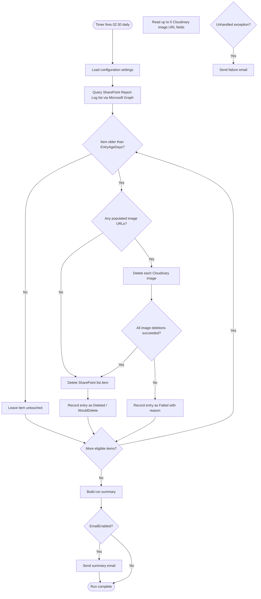

# Functional Specification

**Project:** FB Outlet Conditions Housekeeping
**Version:** 1.1
**Status:** Active
**Last Updated:** 2026-10-08
**Document Owner:** Leon Small

---

# 1. Purpose

The FB Outlet Conditions Housekeeping solution is a scheduled Azure Function
that removes aged "Report Log" entries from a SharePoint list, along with the
Cloudinary-hosted images referenced by those entries.

Explain:

- **What problem it solves:** Report Log entries and their associated
  Cloudinary images accumulate indefinitely, consuming SharePoint list storage
  and Cloudinary media storage, and retaining data beyond its useful
  operational life.
- **Why the solution is required:** There is no existing automated process to
  remove aged entries or their associated images. Manual cleanup is
  error-prone and does not guarantee that orphaned Cloudinary images are
  removed.
- **Who will use it:** The function runs unattended on a daily timer. System
  administrators are the consumers of its output (summary/failure emails) and
  are responsible for its configuration.
- **What business outcome it supports:** Bounded storage growth, reduced
  Cloudinary cost/usage, and a verifiable, auditable housekeeping process with
  a safe dry-run mode.

---

# 2. Scope

## 2.1 In Scope

- Identifying SharePoint "Report Log" list items older than a configurable
  threshold (`EntryAgeDays`).
- Deleting the Cloudinary image(s) referenced by each eligible entry (up to 5
  image URL fields per entry).
- Deleting the SharePoint list item itself, but **only** after all of its
  referenced Cloudinary images have been successfully deleted (or confirmed
  not present).
- A configurable Dry Run mode that performs the full evaluation and reports
  what would be deleted without deleting anything.
- Email notification of a run summary (counts, per-item detail) and of
  unexpected failures.
- Daily timer-triggered execution at 02:30.

## 2.2 Out of Scope

- A user interface for manually triggering or reviewing cleanup runs.
- Deletion of SharePoint list items that are not of the "Report Log" type/list
  being targeted.
- Retention/versioning of deleted data (e.g., soft-delete/archive before
  purge) beyond what SharePoint's own Recycle Bin provides natively.
- Management of the Cloudinary account, folders, or upload process (upload is
  handled by whatever upstream process created the Report Log entry).
- Real-time/on-demand cleanup triggered by list item creation or update.

---

# 3. Users and Personas

| ID    | Persona                | Description                                                        | Responsibilities                                                        |
| ----- | ---------------------- | -------------------------------------------------------------------| ------------------------------------------------------------------------|
| P-001 | System Administrator   | Configures and operates the Function App; receives cleanup emails. | Configures app settings/secrets, monitors runs, responds to failures.   |
| P-002 | Scheduled System Actor | The Azure Functions timer trigger itself; has no interactive user. | Executes the cleanup process unattended once daily.                    |

---

# 4. User Roles and Permissions

| Role                    | Description                                                        | Permissions                                                              |
| ----------------------- | --------------------------------------------------------------------| --------------------------------------------------------------------------|
| Azure AD App Registration | Service principal used by the Function to call Microsoft Graph. | `Sites.ReadWrite.All` (application permission) scoped to the target site via admin consent; no interactive user permissions. |
| System Administrator    | Human operator.                                                    | Configure app settings/Key Vault secrets; read cleanup emails; no in-app roles exist (no UI). |

---

# 5. Functional Requirements

| ID     | Requirement                                                                                                                   | Priority | User Story |
| ------ | --------------------------------------------------------------------------------------------------------------------------- | -------- | ---------- |
| FR-001 | The system shall identify SharePoint "Report Log" list items whose configured date field is older than `EntryAgeDays` days.  | Must     | US-001     |
| FR-002 | The system shall read up to 5 configurable Cloudinary image URL fields from each eligible Report Log entry.                  | Must     | US-001     |
| FR-003 | The system shall delete every non-empty Cloudinary image referenced by an eligible entry before deleting that entry.         | Must     | US-001     |
| FR-004 | The system shall delete the SharePoint list item for an eligible entry only after all of its referenced Cloudinary images have been successfully deleted (or were absent/empty). | Must | US-001 |
| FR-005 | If any Cloudinary image deletion fails for an entry, the system shall not delete that entry's SharePoint list item, and shall record the entry as failed. | Must | US-001 |
| FR-006 | The system shall support a `DryRun` configuration setting that, when `true`, performs all evaluation and logging without invoking any delete operation against Cloudinary or SharePoint. | Must | US-001 |
| FR-007 | The system shall execute automatically once per day at 02:30 via an Azure Functions timer trigger, using a configurable CRON schedule. | Must | US-001 |
| FR-008 | The system shall send a formatted HTML summary email after each run when `EmailEnabled` is `true`, to the configured `EmailRecipients`, from `EmailFromAddress`. | Must | US-001 |
| FR-009 | The system shall send a formatted failure email when the cleanup run terminates due to an unhandled error, when `EmailEnabled` is `true`. | Must | US-001 |
| FR-010 | The system shall not send any email when `EmailEnabled` is `false`.                                                          | Must     | US-001     |
| FR-011 | All external credentials (SharePoint app secret, Cloudinary API secret, SMTP credentials) shall be supplied via Azure Function App configuration/Key Vault references, never hardcoded in source. | Must | US-001 |
| FR-012 | The system shall treat an empty/missing Cloudinary image URL field as "no image to delete" and shall not treat this as a failure. | Must | US-001 |
| FR-013 | The summary email shall report, at minimum: run timestamp, dry-run status, number of entries scanned, number eligible, number successfully deleted, number of entries that failed with reasons, and number of Cloudinary images deleted. | Should | US-001 |

---

# 6. User Stories

## US-001 — Automated Cleanup of Aged Report Log Entries and Cloudinary Images

**As a:** System Administrator

**I want:** aged "Report Log" entries in SharePoint and their associated
Cloudinary images to be automatically deleted on a daily schedule — with
Cloudinary images always removed before the SharePoint entry, a safe dry-run
option, and an email summary of every run

**So that:** SharePoint list storage and Cloudinary media storage do not grow
unbounded, no orphaned Cloudinary images are left behind if a SharePoint
deletion were to happen first, and I have visibility into what was cleaned up
or what failed without needing to inspect logs manually.

### Acceptance Criteria

#### AC-001

**Given:** a Report Log entry whose configured date field is older than
`EntryAgeDays`

**When:** the timer-triggered cleanup function runs

**Then:** the entry is eligible for deletion and processing begins with its
Cloudinary images.

#### AC-002

**Given:** a Report Log entry whose configured date field is **not** older
than `EntryAgeDays`

**When:** the cleanup function runs

**Then:** the entry is left untouched (not processed for deletion).

#### AC-003

**Given:** an eligible entry with 1–5 populated Cloudinary image URL fields

**When:** the entry is processed

**Then:** every populated Cloudinary image is deleted **before** the
SharePoint list item delete is attempted, and the SharePoint list item is
deleted only after all of those image deletions succeed.

#### AC-004

**Given:** an eligible entry where at least one Cloudinary image deletion
fails

**When:** the entry is processed

**Then:** the SharePoint list item is **not** deleted, the entry is recorded
as failed with a reason, and processing continues with the next entry.

#### AC-005

**Given:** `DryRun` is set to `true`

**When:** the cleanup function runs

**Then:** no Cloudinary image is deleted and no SharePoint list item is
deleted, but the run produces the same evaluation/summary output marked as a
dry run.

#### AC-006

**Given:** an eligible entry with fewer than 5 populated Cloudinary image URL
fields

**When:** the entry is processed

**Then:** only the populated fields are processed; empty/missing fields are
skipped without being recorded as a failure.

#### AC-007

**Given:** `EmailEnabled` is `true` and a cleanup run completes (successfully
or with some failed entries)

**When:** the run finishes

**Then:** a formatted summary email is sent to every address in
`EmailRecipients`, from `EmailFromAddress`, containing the run statistics
required by FR-013.

#### AC-008

**Given:** `EmailEnabled` is `true` and the cleanup run throws an unhandled
exception

**When:** the run terminates

**Then:** a formatted failure email is sent to `EmailRecipients` describing
the failure.

#### AC-009

**Given:** `EmailEnabled` is `false`

**When:** a cleanup run completes or fails

**Then:** no email is sent.

### Related Requirements

- FR-001, FR-002, FR-003, FR-004, FR-005, FR-006, FR-007, FR-008, FR-009,
  FR-010, FR-011, FR-012, FR-013

### Related Tests

- TEST-001, TEST-002, TEST-003, TEST-004, TEST-005, TEST-006, TEST-007,
  TEST-008, TEST-009, TEST-010, TEST-011

### Status

`Complete`

---

# 7. Business Rules

| ID     | Business Rule                               | Description                                                                                         |
| ------ | -------------------------------------------- | ----------------------------------------------------------------------------------------------------|
| BR-001 | Cloudinary-before-SharePoint ordering         | A SharePoint Report Log entry must never be deleted before all of its referenced Cloudinary images have been confirmed deleted (or confirmed absent). This prevents orphaned Cloudinary images that can no longer be traced back to a list item. |
| BR-002 | Partial failure isolation                     | A failure processing one entry must not stop the run from processing remaining eligible entries.    |
| BR-003 | Dry run never mutates data                    | When `DryRun` is `true`, no Cloudinary or SharePoint delete API call is ever issued.                |
| BR-004 | Age eligibility is date-field driven           | Eligibility is determined by comparing a configured date field against `DateTime.UtcNow - EntryAgeDays`, not by list item ID or creation order. |

---

# 8. Validation Rules

| ID      | Field/Area           | Validation                                                                 | Error Message                                               |
| ------- | --------------------- | --------------------------------------------------------------------------- | ------------------------------------------------------------ |
| VAL-001 | `EntryAgeDays`         | Must be a non-negative integer (0 is permitted — see EDGE-002).            | "EntryAgeDays must be a non-negative integer."               |
| VAL-002 | `EmailRecipients`      | When `EmailEnabled` is `true`, must contain at least one syntactically valid email address. | "EmailRecipients must contain at least one valid email address when EmailEnabled is true." |
| VAL-003 | Cloudinary image URL field | Must be empty, or a syntactically valid absolute URL from which a Cloudinary `public_id` can be derived. | Logged as a per-entry failure reason; does not stop the run. |

---

# 9. Workflow Specifications



Note: `DeleteImages` and `DeleteSPItem` are no-ops (logged only) when
`DryRun` is `true`; the ordering and branching logic shown above is
unchanged. The `UnhandledError` path represents a run-level exception
(e.g., SharePoint/Graph authentication failure) that aborts the entire run,
distinct from a single entry's `RecordFailure` path which only affects that
entry.

---

# 10. User Interface Requirements

Not applicable. This solution has no user interface; it is a headless,
timer-triggered Azure Function. Its only outward-facing output is the
summary/failure email described in Section 14.

---

# 11. API Requirements

This solution does not expose any inbound API. It is an outbound consumer of
two external APIs:

| Method | Endpoint (conceptual)                                   | Purpose                                      | Authentication                          |
| ------ | --------------------------------------------------------| ----------------------------------------------| ------------------------------------------|
| GET    | Microsoft Graph `/sites/{site-id}/lists/{list-id}/items?$expand=fields` | Enumerate Report Log list items with field values | Azure AD app-only token (client credentials) |
| DELETE | Microsoft Graph `/sites/{site-id}/lists/{list-id}/items/{item-id}`      | Delete a Report Log list item                     | Azure AD app-only token (client credentials) |
| POST/DELETE | Cloudinary Admin API `destroy` (via CloudinaryDotNet SDK)          | Delete a Cloudinary image by `public_id`           | Cloudinary API key/secret                |

---

# 12. Data Requirements

Document:

- **Data entities:** SharePoint "Report Log" list items (read and deleted);
  Cloudinary images (deleted); no local/application database is used.
- **Required data:** a configured date field (age) and up to 5 configured
  Cloudinary image URL fields per list item.
- **Relationships:** one Report Log entry references zero to five Cloudinary
  images by URL; there is no reverse index — the function discovers images
  only via the fields on the entry itself.
- **Data ownership:** the SharePoint site/list owner and Cloudinary account
  owner (same organization).
- **Retention:** governed entirely by `EntryAgeDays`; SharePoint's native
  Recycle Bin provides the only retention safety net after deletion.
- **Audit requirements:** see Section 16.

Refer to:

```text
docs/SCHEMA.md
```

for detailed schema information.

---

# 13. Integration Requirements

| ID      | System               | Direction | Method                              | Purpose                                             |
| ------- | ---------------------| ----------| -------------------------------------| ------------------------------------------------------|
| INT-001 | SharePoint Online    | Outbound  | Microsoft Graph SDK (HTTPS/REST)     | Read and delete Report Log list items.               |
| INT-002 | Cloudinary           | Outbound  | CloudinaryDotNet SDK (HTTPS/REST)    | Delete images referenced by Report Log entries.      |
| INT-003 | SMTP mail server     | Outbound  | MailKit (SMTP)                        | Send summary/failure notification emails.            |

---

# 14. Notifications

| ID      | Trigger                                   | Recipient              | Content                                                                 | Method        |
| ------- | --------------------------------------------| -------------------------| ---------------------------------------------------------------------------| ----------------|
| NOT-001 | Cleanup run completes (success or partial failure) | `EmailRecipients`  | HTML summary: timestamp, dry-run flag, scanned/eligible/deleted/failed counts, per-failure reasons, images deleted count. | SMTP via MailKit |
| NOT-002 | Cleanup run aborts due to an unhandled exception   | `EmailRecipients`  | HTML failure report: timestamp, exception message/type, stage reached before failure. | SMTP via MailKit |

Both notifications are suppressed entirely when `EmailEnabled` is `false`.

---

# 15. Reporting Requirements

Not applicable — there is no interactive reporting UI. The summary email
(Section 14) is the only reporting output, and is not stored for later
querying beyond the recipients' mailboxes and Application Insights logs.

---

# 16. Audit Requirements

- Every Cloudinary deletion attempt (success or failure) is logged via
  `ILogger`, captured by Application Insights, including the `public_id` and
  the owning SharePoint item ID.
- Every SharePoint list item deletion attempt (success or failure) is logged
  via `ILogger`, including the item ID.
- Dry-run evaluations are logged identically to real runs, prefixed to
  clearly indicate no mutation occurred.
- The summary email itself constitutes an at-a-glance audit record of each
  run; full detail is retained in Application Insights per the configured
  Log Analytics retention policy (an operational/infrastructure setting
  outside this application's control).

---

# 17. Security Requirements

- **Authentication:** Azure AD App Registration using the OAuth2 client
  credentials flow (`ClientSecretCredential`) for Microsoft Graph; Cloudinary
  API key/secret; SMTP username/password for MailKit.
- **Authorization:** the Azure AD app is granted the Graph application
  permission `Sites.ReadWrite.All` (or a narrower site-scoped permission via
  Graph's application access policies, recommended) with admin consent.
- **Data protection:** no sensitive personal data is expected in Report Log
  entries beyond operational condition reports; images are deleted, not
  archived elsewhere, as part of this process.
- **Sensitive data:** URLs and `public_id`s may appear in logs; no raw image
  binary or Cloudinary/SharePoint credentials are ever logged.
- **Secrets:** `ClientSecret`, `CloudinaryApiSecret`, and `SmtpPassword` are
  supplied via Azure Function App Configuration / Key Vault references only
  (see `docs/SETUP-GUIDE.md`); never committed to source control.
- **Session management:** not applicable (no interactive session).
- **Security logging:** authentication failures against Graph, Cloudinary, or
  SMTP are logged with exception detail (excluding the secret values
  themselves).

---

# 18. Non-Functional Requirements

## 18.1 Performance

The function is expected to process on the order of tens to low hundreds of
Report Log entries per day; no specific throughput target is defined. Graph
list-item queries are paged to avoid unbounded memory use.

## 18.2 Availability

Standard Azure Functions Consumption/Premium plan availability applies; a
missed daily run due to a platform outage is expected to be covered by the
next scheduled run discovering the same eligible (now older) entries.

## 18.3 Scalability

Not a primary design driver for a once-daily batch job; the implementation
processes entries sequentially per run, which is sufficient for the expected
volume. Documented as a known limitation (Section 23) if volume grows
significantly.

## 18.4 Security

See Section 17.

## 18.5 Maintainability

Core cleanup logic is isolated in a class library (`*.Core`) independent of
the Azure Functions host, behind interfaces (`ISharePointReportLogService`,
`ICloudinaryImageService`, `IEmailNotificationService`), to keep the
Functions project thin and the business logic unit-testable.

## 18.6 Accessibility

Not applicable (no UI). The summary email uses semantic HTML with sufficient
color contrast and a plain-text fallback is not currently implemented (see
Known Limitations, Section 23).

## 18.7 Reliability

A failure processing one entry does not abort the run for other entries
(BR-002). A run-level unhandled exception results in a failure email (when
enabled) and the function reports failure to the Azure Functions host so it
is visible in monitoring.

---

# 19. Error Scenarios

| ID      | Scenario                                               | Expected Behavior                                                                 |
| ------- | ---------------------------------------------------------| ----------------------------------------------------------------------------------|
| ERR-001 | Graph authentication fails (invalid/expired client secret) | Run aborts before processing any entry; failure email sent (if enabled); exception logged and rethrown so the function invocation is marked failed. |
| ERR-002 | Cloudinary deletion fails for one image on an entry       | That entry is recorded as failed; its SharePoint item is not deleted; other entries continue processing. |
| ERR-003 | SharePoint item delete fails after all images were deleted | Entry recorded as failed with reason; images remain deleted (already-performed deletions are not rolled back); next run will find the same entry still eligible with no further images to delete. |
| ERR-004 | SMTP send fails                                            | Logged as an error; does not cause the cleanup run itself to be reported as failed, since the cleanup outcome is independent of notification delivery. |
| ERR-005 | A Cloudinary image URL field cannot be parsed into a `public_id` | Treated as a failed image deletion for that entry per BR-001/AC-004; entry is not deleted. |

---

# 20. Edge Cases

| ID       | Edge Case                                                       | Expected Behavior                                                    |
| -------- | ------------------------------------------------------------------| ------------------------------------------------------------------------|
| EDGE-001 | Entry has zero populated Cloudinary image URL fields              | Entry is eligible for SharePoint deletion directly (AC-006); no Cloudinary call is made. |
| EDGE-002 | `EntryAgeDays` is 0                                                | All entries are immediately eligible regardless of age.              |
| EDGE-003 | No entries are eligible for deletion in a run                     | Summary email (if enabled) still sent, reporting zero eligible/deleted. |
| EDGE-004 | Same Cloudinary URL repeated across two different fields on the same entry | Each configured field is processed independently; the same image is deleted once per occurrence (duplicate `destroy` calls to Cloudinary for an already-deleted asset are tolerated as already-not-found, not treated as a failure). |

---

# 21. Requirements Traceability

| Requirement | User Story | Acceptance Criteria | Test      | Result |
| ----------- | ---------- | ---------------------| ----------| --------|
| FR-001      | US-001     | AC-001, AC-002        | TEST-001, TEST-002 | PASS |
| FR-002, FR-003, FR-012 | US-001 | AC-003, AC-006   | TEST-003, TEST-006 | PASS |
| FR-004, FR-005 | US-001  | AC-003, AC-004        | TEST-003, TEST-004 | PASS |
| FR-006      | US-001     | AC-005                | TEST-005 | PASS |
| FR-007      | US-001     | — (schedule, not unit-testable behavior) | TEST-011 | PASS |
| FR-008, FR-013 | US-001  | AC-007                | TEST-007 | PASS |
| FR-009      | US-001     | AC-008                | TEST-008 | PASS |
| FR-010      | US-001     | AC-009                | TEST-009 | PASS |
| FR-011      | US-001     | — (configuration/security control, verified by code review) | — | Not unit-testable |

---

# 22. Test Summary

| Test ID   | Description                                                                 | Type  | Result |
| --------- | ------------------------------------------------------------------------------| -------| --------|
| TEST-001  | Entry older than `EntryAgeDays` is included in the eligible set.              | Unit  | PASS |
| TEST-002  | Entry not older than `EntryAgeDays` is excluded from the eligible set.        | Unit  | PASS |
| TEST-003  | All Cloudinary images for an entry are deleted before the SharePoint item delete call is made; SharePoint delete only called after all image deletes succeed. | Unit | PASS |
| TEST-004  | A failed Cloudinary image deletion prevents the SharePoint item delete call and records a failure. | Unit | PASS |
| TEST-005  | `DryRun = true` results in zero calls to the Cloudinary delete API and zero calls to the SharePoint delete API. | Unit | PASS |
| TEST-006  | Entry with fewer than 5 populated image fields only processes the populated ones; empty fields are skipped without failure. | Unit | PASS |
| TEST-007  | Summary email is sent with correct counts when `EmailEnabled = true`.         | Unit  | PASS |
| TEST-008  | Failure email is sent when the orchestrator run throws.                      | Unit  | PASS |
| TEST-009  | No email is sent (summary or failure) when `EmailEnabled = false`.           | Unit  | PASS |
| TEST-010  | Cloudinary `public_id` is correctly parsed from representative Cloudinary delivery URLs, including a confirmed real-world production example (Dynamic Folder Mode account, see `docs/SCHEMA.md` Section 17). | Unit | PASS |
| TEST-011  | Timer schedule constant is configured as `0 30 2 * * *` (02:30 daily).        | Unit  | PASS |

All tests listed above were implemented using xUnit and Moq and were actually
executed via `dotnet test`; see the Implementation Summary for the executed
command and result counts.

---

# 23. Known Limitations

- Entries are processed sequentially within a run; no parallelism is
  implemented. For the expected daily volume this is not expected to be an
  issue, but very large backlogs could extend run duration.
- SharePoint Graph list-item age filtering is performed client-side after
  retrieving pages of items (rather than via an indexed server-side
  `$filter`), because the target list's date field is not guaranteed to be
  indexed. This is simpler and more reliable across arbitrary list
  configurations but less efficient for very large lists.
- If a SharePoint item delete fails after its Cloudinary images were already
  deleted (ERR-003), those images are not restorable; the entry is retried
  on the next run with no further Cloudinary work required, but the failure
  is surfaced in that run's email so it does not go unnoticed.
- Summary/failure emails are HTML-only; no plain-text alternative part is
  generated.
- True end-to-end testing against live SharePoint/Cloudinary/SMTP services
  was not performed (no live tenant/credentials available in this
  environment) — see Final Validation for details. Unit-level testing fully
  covers the orchestration logic using test doubles for all three external
  integrations.

---

# 24. Future Enhancements

These are not currently implemented:

- Server-side (indexed) date filtering via Graph `$filter` for large lists.
- Parallel/batched processing of eligible entries with configurable
  concurrency.
- Plain-text email alternative part.
- Soft-delete/archive step prior to permanent deletion.
- Per-run persisted audit record (e.g., to a storage table) in addition to
  email and Application Insights logging.

---

# 25. Specification Change History

| Version | Date       | Change                                   | Author      |
| ------- | ---------- | ------------------------------------------| -------------|
| 1.0     | 2026-10-08 | Initial specification for new project.    | Claude Code |
| 1.1     | 2026-10-08 | Updated TEST-010's description to reflect the new confirmed real-world Cloudinary URL test case (see docs/SCHEMA.md Section 17). | Claude Code |
